# CFD 后处理结果详解

> 缺失的图片在生成仿真结果后会正常渲染。

## 0. 全局参数速查

### 0.1 几何与参考量

| 量 | 符号 | 来源 |
| --- | --- | --- |
| 机长 | L | STL 包围盒 |
| 翼展 | b | STL 包围盒 |
| 机高 | h | STL 包围盒 |
| 机翼参考面积 | S_ref | 平面形积分 |
| 平均气动弦长 | MAC | 梯形翼积分 |
| 展弦比 | AR = b²/S | 计算 |
| 1/4 弦点（取矩中心） | x_qc | 计算 |
| 机体体积 | V_body | 体素重建 |

### 0.2 来流状态

| 量 | 符号 | 推导/来源 |
| --- | --- | --- |
| 温度 | T∞ | ISA：288.15 − 6.5×5 |
| 压强 | p∞ | ISA 积分 |
| 密度 | ρ∞ | p/(RT) |
| 动力粘度 | μ | Sutherland 公式 |
| 声速 | a∞ | √(γRT) |
| 速度 | V∞ | 设定巡航点 |
| 马赫数 | Ma | V/a |
| 动压 | q∞ | ½ρV² |
| 雷诺数 | Re | ρVMAC/μ |

## 1. 后处理管线总览

### 1.1 数据链路

```
artifacts/cases/final_aoa{0,4,8,12}.cas.h5 + .dat.h5     ← Fluent 求解结果
        │
        │  scripts/04_post/extract_post.py
        │
        ▼
results/fields_aoa{0,4,8,12}.npz                          ← 抽取出的离散场
        │  壁面网格 + 压力
        │  y=0 对称面 / z=0 水平面 / 5 个流向站位截面
        │  5 组流线（pathlines）+ 沿途 |V|
        │
        │  scripts/04_post/render_post.py
        ▼
scripts/04_post/make_report.py──▶  results/report.html
```

### 1.2 抽取阶段（`extract_post.py`）

启动 Fluent 求解器会话后，对每个 case：

1. **建几何切面**

| 切面名 | API 调用 | 数学含义 |
| --- | --- | --- |
| `sym_y0` | `zx-plane`, y = 0 | 机体对称面，展向中心 |
| `hor_z0` | `xy-plane`, z = 0 | 过机翼弦线的水平面 |
| `xs_8 / 15 / 24 / 34 / 48` | `yz-plane`, x = 8…48 m | 5 个流向站位横截面 |

2. **建流线种子线（`/surface/line-surface`）**

| 种子 | 起止点 (x, y, z) | 目的 |
| --- | --- | --- |
| `seed_line` | (−12, 0, −7) → (−12, 0, 7) | 对称面全域流线（上游 12 m 处） |
| `seed_line_hi` | (−12, 0, −4) → (−12, 0, 4) | 对称面近场加密 |
| `seed_tip` | (−6, 9.4, 0) → (−6, 11.9, 0) | **翼尖涡**（展向 9.4–11.9 m，翼尖在 11.82 m） |
| `seed_tip2` | (−6, 11.9, 0.6) → (−6, 12.8, 0.6) | 翼尖外侧补充 |
| `seed_mid` | (−6, 3.0, 0.2) → (−6, 7.0, 0.2) | 中段翼展流线 |

3. **取场数据（PyFluent `field_data` 服务）**

- 壁面：`Vertices / FacesConnectivity / FacesNormal / FacesCentroid` + 压力（`node_value=True` 与 `False` 各一份）
- 对称面：速度幅值、压力、涡量幅值、湍动能、Q 判据
- 水平面与站位面：速度幅值、涡量幅值、Q 判据
- 流线：`PathlinesFieldDataRequest(steps=230, step_size=0.35, accuracy_control_on=True, tolerance=0.001)`

### 1.3 npz 里的键（`fields_aoa*.npz`）

```
aoa
wall_verts / wall_conn / wall_nrm / wall_cen     壁面网格与法向、面心
wall_p       压力（节点值，用于平滑 3D 渲染）
wall_pf      压力（面值，  用于 flat 云图 + 2D 三角化）
sym_verts / sym_conn + sym_velocity_magnitude / sym_pressure /
                       sym_vorticity_mag / sym_turb_kinetic_energy / sym_q_criterion
hor_verts / hor_conn + hor_velocity_magnitude / hor_vorticity_mag / hor_q_criterion
xs{8,15,24,34,48}_verts / _conn + _velocity_magnitude / _vorticity_mag / _q_criterion
pl_{seed_line,seed_line_hi,seed_tip,seed_tip2,seed_mid}_verts / _lines / _val
```

## 2. 数学与物理基础

### 2.1 控制方程：RANS 与 k-ω SST

本次求解的是**稳态可压雷诺平均 Navier–Stokes（RANS）**方程。

**连续方程（质量守恒）**

对控制体 Ω 应用质量守恒：

$$
\frac{\partial \rho}{\partial t} + \nabla\!\cdot\!(\rho \mathbf{u}) = 0
$$

稳态下 $\partial/\partial t = 0$，得 $\nabla\!\cdot\!(\rho\mathbf{u})=0$。

**动量方程（牛顿第二定律）**

$$
\frac{\partial}{\partial t}(\rho\mathbf{u}) + \nabla\!\cdot\!(\rho\mathbf{u}\otimes\mathbf{u})
= -\nabla p + \nabla\!\cdot\!\boldsymbol{\tau} + \rho\mathbf{g}
$$

其中 $\boldsymbol{\tau}$ 为粘性应力张量。对牛顿流体、Stokes 假设：

$$
\boldsymbol{\tau} = \mu\left[\nabla\mathbf{u} + (\nabla\mathbf{u})^\mathsf{T} - \tfrac{2}{3}(\nabla\!\cdot\!\mathbf{u})\mathbf{I}\right]
$$

**能量方程**（开启 `energy` 模型，因为压力远场边界要求理想气体）

$$
\frac{\partial}{\partial t}(\rho E) + \nabla\!\cdot\!\bigl[\mathbf{u}(\rho E + p)\bigr]
= \nabla\!\cdot\!\left(k_{\text{eff}}\nabla T + \boldsymbol{\tau}\!\cdot\!\mathbf{u}\right)
$$

**雷诺平均与封闭问题**

把瞬时量写成 $\phi = \bar\phi + \phi'$ 代入，动量方程多出一项雷诺应力：

$$
-\rho\,\overline{\mathbf{u}'\otimes\mathbf{u}'}
$$

这是 6 个未知量 —— 未知量个数超过方程数，即**湍流封闭问题**。

**Boussinesq 涡粘假设**：类比分子粘性，设

$$
-\rho\overline{u_i' u_j'} = \mu_t\left(\frac{\partial \bar u_i}{\partial x_j} + \frac{\partial \bar u_j}{\partial x_i}\right)
- \frac{2}{3}\left(\rho k + \mu_t\frac{\partial \bar u_l}{\partial x_l}\right)\delta_{ij}
$$

其中 $k = \tfrac12\overline{u_i'u_i'}$ 为湍动能，$\mu_t$ 为湍流粘度 —— 只需要再求出 $\mu_t$。

**k-ω SST**（Menter）用两个输运方程定 $\mu_t$：

$$
\frac{\partial}{\partial t}(\rho k) + \nabla\!\cdot\!(\rho k\mathbf{u})
= \nabla\!\cdot\!\left[\left(\mu + \frac{\mu_t}{\sigma_k}\right)\nabla k\right] + P_k - \beta^{*}\rho k\omega
$$

$$
\frac{\partial}{\partial t}(\rho\omega) + \nabla\!\cdot\!(\rho\omega\mathbf{u})
= \nabla\!\cdot\!\left[\left(\mu + \frac{\mu_t}{\sigma_\omega}\right)\nabla\omega\right]
+ \frac{\gamma}{\nu_t}P_k - \beta\rho\omega^2 + 2(1-F_1)\frac{\rho\sigma_{\omega,2}}{\omega}\nabla k\!\cdot\!\nabla\omega
$$

湍流粘度：

$$
\mu_t = \frac{\rho k}{\omega}\cdot\frac{1}{\max\!\left[\dfrac{1}{\alpha^{*}},\ \dfrac{SF_2}{a_1\omega}\right]}
$$

**为什么选 k-ω SST**：

- 近壁区用 $k$-$\omega$ 形式 —— 对**逆压梯度与分离**敏感，能较好预测 12° 攻角的机翼分离；
- 远场用 $k$-$\varepsilon$ 形式（通过混合函数 $F_1$ 切换）—— 避免 $k$-$\omega$ 对来流 $\omega$ 过于敏感；
- 含**剪切应力输运（SST）限制器** —— 改善逆压梯度下 $\mu_t$ 的过预测。

这正是无人机在 8°–12° 攻角（接近巡航上限/机动）时最需要的特性。

### 2.2 无量纲化：力系数与压力系数

**为什么需要无量纲化**：使结果不依赖具体尺寸、速度、大气密度，可在风洞/不同飞行状态间直接比较。

气动力的量级来自动压 $q_\infty = \tfrac12\rho_\infty V_\infty^2$ 与参考面积 $S$ 的乘积，故定义

$$
\boxed{C_L = \frac{L}{q_\infty S}},\qquad
\boxed{C_D = \frac{D}{q_\infty S}},\qquad
\boxed{C_M = \frac{M}{q_\infty S\,\ell}}
$$

其中 $\ell$ 为参考长度，本例取 **MAC = 4.200 m**（俯仰力矩惯例）。

**升力/阻力的方向定义**（随攻角 $\alpha$ 旋转的风轴系）：

$$
\hat{\mathbf{e}}_D = (\cos\alpha,\ 0,\ \sin\alpha),\qquad
\hat{\mathbf{e}}_L = (-\sin\alpha,\ 0,\ \cos\alpha)
$$

本机 X 为飞行方向、Z 为垂向，来流沿 +X，攻角绕 +Y 轴抬起机头。
`final_solve.py` 中即用这两个向量做 `force_vector` 投影，因此**报告中的 L/D 是真风轴升阻**，
不是简单的 $F_z$/$F_x$。

**压力系数**

$$
\boxed{C_p = \frac{p - p_\infty}{q_\infty}} = \frac{p-p_\infty}{\tfrac12\rho_\infty V_\infty^2}
$$

由伯努利方程（不可压、无粘、沿流线）：

$$
p + \tfrac12\rho V^2 = p_\infty + \tfrac12\rho V_\infty^2
\;\Longrightarrow\;
p - p_\infty = \tfrac12\rho(V_\infty^2 - V^2)
$$

代入定义：

$$
C_p = \frac{V_\infty^2 - V^2}{V_\infty^2} = 1 - \left(\frac{V}{V_\infty}\right)^2
$$

**这是读所有压力云图的钥匙**：

| C_p | 含义 | 局部速度 |
| --- | --- | --- |
| +1 | 驻点（速度为零） | V = 0 |
| 0 | 与来流同压同速 | V = V∞ |
| < 0 | 吸力区（加速） | V > V∞ |
| −1 | | V = 1.41 V∞ |
| −2.73（本例 12° 最小值） | 强吸力峰 | V = 1.93 V∞ |

本例实测极值（直接从 `wall_pf` 算得）：

| α [°] | C_p,min | C_p,max | 最大 V/V∞ |
| ---: | ---: | ---: | ---: |
| 0 | −1.118 | +1.044 | 1.46 |
| 4 | −1.247 | +1.011 | 1.50 |
| 8 | −1.998 | +0.998 | 1.73 |
| 12 | −2.734 | +1.010 | 1.93 |

> C_p,max ≈ +1.0 出现在机头/翼前缘驻点，是**理论上限**，说明压力场求解是自洽的。

### 2.3 5 km ISA 大气推导

**对流层（0–11 km）温度线性递减**（ISA 定义）：

$$
T(h) = T_0 - \Lambda h,\qquad T_0 = 288.15\ \text{K},\quad \Lambda = 6.5\ \text{K/km}
$$

$$
T(5\ \text{km}) = 288.15 - 6.5\times 5 = \mathbf{255.65\ K}
$$

**压强**：静力平衡 $\mathrm{d}p = -\rho g\,\mathrm{d}h$ 与理想气体 $\rho = p/(RT)$ 联立：

$$
\frac{\mathrm{d}p}{p} = -\frac{g}{R T(h)}\mathrm{d}h = -\frac{g}{R(T_0 - \Lambda h)}\mathrm{d}h
$$

积分：

$$
\ln\frac{p}{p_0} = \frac{g}{R\Lambda}\ln\frac{T_0-\Lambda h}{T_0}
\;\Longrightarrow\;
\boxed{p = p_0\left(1 - \frac{\Lambda h}{T_0}\right)^{\frac{g}{R\Lambda}}}
$$

指数 $g/(R\Lambda) = 9.80665/(287.05\times 0.0065) = 5.2559$。代入 $h = 5000$ m：

$$
\frac{p}{p_0} = \left(\frac{255.65}{288.15}\right)^{5.2559} = 0.5334
\;\Longrightarrow\; p = 101325\times 0.5334 = \mathbf{54\,019.9\ Pa}
$$

**密度**（理想气体）：

$$
\rho = \frac{p}{RT} = \frac{54019.9}{287.05\times 255.65} = \mathbf{0.736\,12\ kg/m^3}
$$

**声速**（等熵）：

$$
a = \sqrt{\gamma R T} = \sqrt{1.4\times 287.05\times 255.65} = \mathbf{320.53\ m/s}
\quad\Rightarrow\quad \mathrm{Ma} = \frac{60}{320.53} = \mathbf{0.187}
$$

**动力粘度（Sutherland 公式）**：

$$
\mu = \mu_0\left(\frac{T}{T_0}\right)^{3/2}\frac{T_0 + S}{T + S},\qquad
\mu_0 = 1.716\times10^{-5}\ \text{Pa·s},\ S = 110.4\ \text{K}
$$

$$
\mu = 1.716\times10^{-5}\left(\frac{255.65}{273.15}\right)^{1.5}\frac{273.15+110.4}{255.65+110.4}
= \mathbf{1.628\times10^{-5}\ Pa\cdot s}
$$

**动压与雷诺数**：

$$
q_\infty = \tfrac12\rho V^2 = \tfrac12\times0.73612\times 60^2 = \mathbf{1325.01\ Pa}
$$

$$
\mathrm{Re}_{\text{MAC}} = \frac{\rho V\,\mathrm{MAC}}{\mu}
= \frac{0.73612\times 60\times 4.200}{1.628\times10^{-5}} = \mathbf{1.14\times10^{7}}
$$

> 这个雷诺数量级（10⁷）说明**惯性力远大于粘性力**，边界层为**湍流**，
> 摩擦阻力占比小、压差阻力（含诱导阻力）占比大 —— 与后文极曲线分解一致。

### 2.4 可压性判据：临界压力系数 $C_p^{*}$

**问题**：Ma = 0.187 算不算可压？什么时候必须考虑压缩性？

**推导**：设来流 $\mathrm{Ma}_\infty$，局部等熵加速到 $\mathrm{Ma} = 1$ 时的压强为 $p^{*}$。
总压 $p_0$ 沿流线不变（等熵）：

$$
\frac{p_0}{p_\infty} = \left(1 + \frac{\gamma-1}{2}\mathrm{Ma}_\infty^2\right)^{\frac{\gamma}{\gamma-1}}
$$

$$
\frac{p^{*}}{p_0} = \left(\frac{2}{\gamma+1}\right)^{\frac{\gamma}{\gamma-1}}
$$

两式相除：

$$
\frac{p^{*}}{p_\infty} =
\left[\frac{2}{\gamma+1}\left(1+\frac{\gamma-1}{2}\mathrm{Ma}_\infty^2\right)\right]^{\frac{\gamma}{\gamma-1}}
$$

代入 $C_p$ 定义：

$$
\boxed{C_p^{*} = \frac{2}{\gamma\,\mathrm{Ma}_\infty^2}\left(\frac{p^{*}}{p_\infty} - 1\right)}
$$

**本例数值**（$\gamma = 1.4$，$\mathrm{Ma}_\infty = 0.187$）：

$$
\frac{p^{*}}{p_\infty} = \left[\frac{2}{2.4}(1+0.2\times0.0350)\right]^{3.5}
= (0.8333\times1.00701)^{3.5} = 0.5414
$$

$$
C_p^{*} = \frac{2}{1.4\times 0.0350}(0.5414 - 1) = 40.82\times(-0.4586) = -18.72
$$

**结论**：要在本工况下产生局部激波/超声速区，需要 $C_p \le -18.7$；
而实测最低只有 **−2.73**（12°）。相差 6.8 倍 →

> **流场全域严格亚声速、可视为不可压**。
> 这解释了为什么 $\mathrm{C_p}=1-(V/V_\infty)^2$ 这个不可压关系与实测吻合（C_p,max ≈ +1）。
> 也说明：本次因"压力远场边界只支持理想气体"而启用可压求解器，
> 只是**求解器形式**上的要求，物理上压缩性效应可忽略。

### 2.5 升力线理论：CL_α、下洗、诱导阻力

**物理图像**：有限翼展机翼的下表面高压气流会绕过翼尖翻到上表面 →
翼尖处上下压差被泄掉 → **展向环量 Γ(y) 沿展向变化** →
按 Helmholtz 定理，变化的环量必向下游拖出自由涡（尾涡系）→
尾涡在机翼处诱导**下洗速度 w** → 有效攻角减小 → 产生**诱导阻力**。

**Prandtl 升力线理论**

把机翼换成一条附着涡线（沿 y，强度 Γ(y)），尾涡沿 x 拖出。
在展向位置 $y_0$ 处，尾涡系诱导的下洗：

$$
w(y_0) = \frac{1}{4\pi}\int_{-b/2}^{b/2}\frac{\mathrm{d}\Gamma/\mathrm{d}y}{y_0 - y}\,\mathrm{d}y
$$

由 Kutta–Joukowski 定理（二维）：

$$
\ell(y) = \rho V\,\Gamma(y)
$$

以及有效攻角：$\alpha_{\text{eff}}(y) = \alpha - \alpha_{L=0} - \frac{w(y)}{V}$，
局部升力 $\ell(y) = \tfrac12\rho V^2 c(y)\,a_0\,\alpha_{\text{eff}}(y)$（$a_0 = 2\pi$/rad 为二维升力线斜率）。

联立得 **Prandtl 积分微分方程**：

$$
\frac{2\Gamma(y)}{a_0\,c(y)\,V} = \alpha - \alpha_{L=0}(y) - \frac{1}{4\pi V}\int_{-b/2}^{b/2}\frac{\mathrm{d}\Gamma/\mathrm{d}y'}{y-y'}\,\mathrm{d}y'
$$

**椭圆环量分布解**：设 $\Gamma(y) = \Gamma_0\sqrt{1-(2y/b)^2}$，代入可得 $w$ 沿展向**常数**：

$$
w = \frac{\Gamma_0}{2b} = \frac{V C_L}{\pi\,\mathrm{AR}}
$$

推导（椭圆载荷下 $\int_{-b/2}^{b/2}\Gamma\,\mathrm{d}y = \Gamma_0 \frac{\pi b}{4}$，
$L = \rho V\int\Gamma\,\mathrm{d}y = \rho V\Gamma_0\frac{\pi b}{4} = \tfrac12\rho V^2 S C_L$）：

$$
\Gamma_0 = \frac{2 V S C_L}{\pi b},\qquad
w = \frac{\Gamma_0}{2b} = \frac{V S C_L}{\pi b^2} = \frac{V C_L}{\pi\,\mathrm{AR}}
\quad\bigl(\text{其中 }\mathrm{AR}=b^2/S\bigr)
$$

**诱导攻角**：

$$
\boxed{\alpha_i = \frac{w}{V} = \frac{C_L}{\pi\,\mathrm{AR}}}
$$

**有限翼展的升力线斜率**：

$$
\alpha_{\text{eff}} = \alpha - \alpha_i = \alpha - \frac{C_L}{\pi\mathrm{AR}},\qquad C_L = a_0\,\alpha_{\text{eff}}
$$

$$
\boxed{C_{L,\alpha} = \frac{\mathrm{d}C_L}{\mathrm{d}\alpha}
= \frac{a_0}{1 + \dfrac{a_0}{\pi\,\mathrm{AR}}}}
$$

**本例数值**：AR = 8.556，$a_0 = 2\pi = 6.283$/rad：

$$
C_{L,\alpha}^{\text{理论}} = \frac{6.283}{1 + \dfrac{6.283}{\pi\times 8.556}}
= \frac{6.283}{1 + 0.2338} = \mathbf{5.093\ /rad} = 0.0889\ /\text{deg}
$$

**实测**（对 0–8° 做最小二乘）：

$$
C_{L,\alpha}^{\text{CFD}} = \mathbf{4.490\ /rad} = 0.0784\ /\text{deg},\qquad
\frac{\text{CFD}}{\text{理论}} = \mathbf{0.882}
$$

差距 12% 的物理来源：

| 来源 | 说明 |
| --- | --- |
| 机身/尾撑干扰 | 升力线理论只算单独机翼，机身贡献为负 |
| 平尾负升力 | 配平状态下平尾通常产生**向下**的力 → 降低整机 C_L |
| 粘性效应 | 理论假设无粘，实际边界层使有效弯度略降 |
| 非椭圆载荷 | 后掠 40.6° 的梯形翼载荷偏离椭圆 → e < 1 |
| 网格粗 / y+ 大 | 近壁分辨率不足带来的数值误差 |

**诱导阻力**

下洗把升力矢量向后倾斜 $\alpha_i$，其水平分量即诱导阻力：

$$
D_i = L\sin\alpha_i \approx L\,\alpha_i
\;\Longrightarrow\;
\boxed{C_{D,i} = C_L\,\alpha_i = \frac{C_L^2}{\pi\,\mathrm{AR}}}
$$

更一般地引入 **Oswald 效率因子 e**（e ≤ 1，椭圆载荷时 e = 1）：

$$
\boxed{C_{D,i} = \frac{C_L^2}{\pi\,\mathrm{AR}\,e}},\qquad
\alpha_i = \frac{C_L}{\pi\,\mathrm{AR}\,e}
$$

**本例的理论诱导角**（AR = 8.556）：

| C_L | α_i（e = 1） | 下洗 w（V=60 m/s） |
| ---: | ---: | ---: |
| 0.3408 | 0.726° | 0.76 m/s |
| 0.6487 | **1.383°** | 1.45 m/s |
| 0.8836 | 1.883° | 1.97 m/s |

**环量（椭圆载荷翼根值）**：

$$
\Gamma_0 = \frac{4L}{\rho V\pi b}
$$

| C_L | L [N] | Γ₀ [m²/s] |
| ---: | ---: | ---: |
| 0.3408 | 29 504 | 35.97 |
| 0.6487 | 56 160 | **68.47** |

Γ₀ 正是**翼尖涡的强度**——它直接决定 `vortex3d` 图里涡核的旋转快慢，
也决定尾涡对后方飞机的危害等级（见 §5）。

### 2.6 极曲线分解与 Oswald 效率

**模型**：把阻力拆成两部分

$$
\boxed{C_D = C_{D,0} + k\,C_L^2},\qquad k \equiv \frac{1}{\pi\,\mathrm{AR}\,e}
$$

- $C_{D,0}$：**零升阻力**（摩擦阻力 + 压差阻力 + 干扰阻力），与升力无关；
- $kC_L^2$：**诱导阻力**（升力依赖），随 C_L² 增长。

**最小二乘拟合**（4 个数据点，设计矩阵 $\mathbf{X} = [C_L^2,\ 1]$）：

$$
\hat{\boldsymbol\beta} = (\mathbf{X}^\mathsf{T}\mathbf{X})^{-1}\mathbf{X}^\mathsf{T}\mathbf{C_D}
$$

**本例结果**：

$$
\boxed{C_D = 0.06990 + 0.16600\,C_L^2}\qquad R^2 = 0.990
$$

| α | C_D 实测 | 拟合值 | 残差 |
| ---: | ---: | ---: | ---: |
| 0 | 0.0733 | 0.0699 | +0.0034 |
| 4 | 0.0897 | 0.0892 | +0.0005 |
| 8 | 0.1315 | 0.1398 | −0.0083 |
| 12 | 0.2039 | 0.1995 | +0.0044 |

**反推 Oswald 效率因子**：

$$
e = \frac{1}{\pi\,\mathrm{AR}\,k} = \frac{1}{\pi\times 8.556\times 0.166} = \mathbf{0.224}
$$

> e = 0.224 意味着拟合出的"诱导阻力"是理想椭圆载荷的 4.5 倍 ——
> **不是真实物理，而是数值误差的信号**：
>
> 1. 无边界层棱柱（y+ ≈ 940）→ 壁面函数高估近壁剪切与分离；
> 2. 尾迹区网格偏粗（远场 2.5 m）→ 尾涡在 5 个站位内过快耗散，
>    使诱导阻力被"数值耗散"放大；
> 3. 12° 已有机翼分离，分离阻力被 $kC_L^2$ 强行吸收。
>
> 若取真实 e ≈ 0.80，则 $k = 1/(\pi\times8.556\times0.80) = 0.0465$，
> 仅为拟合值的 **28%** —— 这与"CD 高估约 2.5–3 倍"的结论一致。

**最佳升阻比**（对极曲线求极值）：

$$
\frac{L}{D} = \frac{C_L}{C_{D,0} + kC_L^2},\qquad
\frac{\mathrm{d}}{\mathrm{d}C_L}\left(\frac{L}{D}\right) = 0
\;\Longrightarrow\; C_{D,0} - kC_L^2 = 0
$$

$$
\boxed{C_{L,\,(L/D)_{\max}} = \sqrt{\frac{C_{D,0}}{k}}},\qquad
\boxed{\left(\frac{L}{D}\right)_{\max} = \frac{1}{2\sqrt{C_{D,0}\,k}}}
$$

本例：$C_L^{*} = \sqrt{0.0699/0.166} = 0.649$（对应 α ≈ 8.0°），
$(L/D)_{\max} = 1/(2\sqrt{0.0699\times0.166}) = \mathbf{4.64}$
（实测 4.93，因为 8° 点的残差为负，实际略优于拟合）。

> 物理含义：**最佳巡航点就在 C_L ≈ 0.65、α ≈ 8°**，
> 此时诱导阻力恰好等于零升阻力（$kC_L^2 = C_{D,0}$）。

### 2.7 涡量与 Q 判据

**涡量定义**：

$$
\boldsymbol{\omega} = \nabla\times\mathbf{u}
$$

物理意义：涡量等于流体微团**瞬时角速度的两倍**（$\boldsymbol\omega = 2\boldsymbol\Omega$）。
$\boldsymbol\omega = 0$ 的区域是无旋流动（可用势流理论）。

**为什么用涡量看尾涡**：翼尖涡的存在区域涡量集中；
尾迹剪切层（边界层脱离后形成的速度不连续）也表现为高涡量带。

**涡量输运方程**（由 N-S 方程取旋度得到，不可压）：

$$
\frac{D\boldsymbol\omega}{Dt} = (\boldsymbol\omega\!\cdot\!\nabla)\mathbf{u}
- \boldsymbol\omega(\nabla\!\cdot\!\mathbf{u})
+ \nu\nabla^2\boldsymbol\omega
+ \frac{1}{\rho^2}\nabla\rho\times\nabla p
$$

四项依次为：**涡拉伸**、体积膨胀、粘性扩散、斜压生成。
翼尖涡在下洗中被拉伸 → 涡量集中、核半径收缩（涡管的角动量守恒）。

**Q 判据（Hunt 等，1988）** —— 更严格的涡识别方法

速度梯度张量分解为对称部分（应变率）与反对称部分（旋转率）：

$$
\nabla\mathbf{u} = \mathbf{S} + \boldsymbol\Omega,\qquad
\mathbf{S} = \tfrac12\left[\nabla\mathbf{u} + (\nabla\mathbf{u})^\mathsf{T}\right],\qquad
\boldsymbol\Omega = \tfrac12\left[\nabla\mathbf{u} - (\nabla\mathbf{u})^\mathsf{T}\right]
$$

定义第二不变量：

$$
\boxed{Q = \tfrac12\left(\|\boldsymbol\Omega\|^2 - \|\mathbf{S}\|^2\right)
= -\tfrac12\frac{\partial u_i}{\partial x_j}\frac{\partial u_j}{\partial x_i}}
$$

**判据**：$Q > 0$ → 当地**旋转率超过应变率** → 该处是真正的涡核，
而非单纯的剪切层（剪切层 $Q<0$）。

> 这是 `wake_xsections` / `wake_horizontal` 用 Q 判据而非只用涡量幅值的原因：
> 涡量幅值在壁面附近的边界层里也很大（那是剪切，不是涡），Q 判据能剔除它。

**翼尖涡的衰减**：粘性扩散使涡核半径随时间增长

$$
r_c(t) \approx r_0 + \sqrt{\frac{4\nu t}{\pi}}\quad\text{(层流)} ,\qquad
\Gamma(r) = \Gamma_0\left(1 - e^{-r^2/r_c^2}\right)\ \text{(Lamb–Oseen 涡)}
$$

Lamb–Oseen 涡的切向速度分布：

$$
V_\theta(r) = \frac{\Gamma_0}{2\pi r}\left(1 - e^{-r^2/r_c^2}\right),\qquad
V_{\theta,\max} \text{ 在 } r \approx 1.12\,r_c
$$

### 2.8 壁面律、y+ 与壁面函数

**无量纲壁面距离**：

$$
\boxed{y^+ = \frac{\rho\,u_\tau\,y}{\mu} = \frac{u_\tau\,y}{\nu}},\qquad
u_\tau = \sqrt{\frac{\tau_w}{\rho}}
$$

**摩擦速度**由壁面切应力定义。用平板湍流局部摩擦系数估算（Re_x ≈ 10⁷）：

$$
c_f = 0.0592\,\mathrm{Re}_x^{-1/5},\qquad \tau_w = \tfrac12\rho V^2 c_f,\qquad u_\tau = \sqrt{\tau_w/\rho}
$$

**本例数值**（x = MAC = 4.2 m 处）：

$$
\mathrm{Re}_x = \frac{0.7361\times60\times4.2}{1.628\times10^{-5}} = 1.14\times10^{7}
$$

$$
c_f = 0.0592\times(1.14\times10^{7})^{-0.2} = 0.00230,\quad
\tau_w = \tfrac12\times0.7361\times3600\times0.00230 = 3.05\ \text{Pa}
$$

$$
u_\tau = \sqrt{3.05/0.7361} = \mathbf{2.03\ m/s}
$$

**湍流边界层三层结构**：

| 层 | y⁺ 范围 | 速度律 |
| --- | --- | --- |
| 粘性底层 | y⁺ < 5 | $u^+ = y^+$ |
| 过渡层 | 5 < y⁺ < 30 | — |
| 对数律层 | y⁺ > 30 | $u^+ = \dfrac{1}{\kappa}\ln y^+ + B$，$\kappa=0.41,\ B=5.25$ |

其中 $u^+ = u/u_\tau$。

**本例的 y⁺**：实测中位数 **940**，反推第一层网格高度

$$
y = \frac{y^+\,\mu}{\rho\,u_\tau} = \frac{940\times1.628\times10^{-5}}{0.7361\times2.03}
= 0.0122\ \text{m} = \mathbf{12.2\ mm}
$$

**后果**：$y^+ = 940 \gg 30$ → 第一层网格落在**对数律层内** →
Fluent 只能启用**壁面函数（standard wall functions）**来桥接壁面，
而不能直接积分到 $y^+=1$（那需要 $y \approx 13\ \mu$m）。

壁面函数用对数律反推壁面切应力：

$$
\tau_w = \frac{\rho\,\kappa\,u_\tau\,u_p}{\ln(E\,y^+)},\qquad E = 9.793
$$

**对结果的影响**（这是本次最大的误差源）：

| 影响项 | 方向 | 量级 |
| --- | --- | --- |
| 摩擦阻力 | 高估（壁面函数对粗网格 + 分离敏感） | 主要贡献 |
| 分离预测 | 起始点偏早、范围偏大 | 12° 尤其明显 |
| C_L | 影响较小（压力主导） | < 5% |
| C_D | **高估约 2.5–3 倍** | 主要误差 |

> 这解释了为什么 §2.6 反推的 e = 0.224 远低于物理值：
> 分离 + 壁面函数把大量"假阻力"灌进了 $kC_L^2$ 项。

### 2.9 俯仰力矩、中性点与静稳定裕度

**本次的缺口**：`rd.moment` 报告定义未能创建，结果里 $C_M = \text{null}$。
下面给出**应有的推导与后续补算方法**。

取矩中心在 1/4 弦点 $\mathbf{r}_0 = (7.932, 0, 0)$（由 `refgeom.json` 给出）。
壁面压力与切应力对 $\mathbf{r}_0$ 的俯仰力矩（绕 +Y 轴）：

$$
M_y = \sum_{\text{faces}}\Bigl[(\mathbf{r}_f - \mathbf{r}_0)\times
\bigl((-p\,\hat{\mathbf{n}} + \boldsymbol{\tau}_w)\,A_f\bigr)\Bigr]\!\cdot\!\hat{\mathbf{e}}_y
$$

无量纲化：

$$
C_{M,y} = \frac{M_y}{q_\infty S\,\mathrm{MAC}}
$$

**静稳定性判据**：

$$
\boxed{\frac{\mathrm{d}C_M}{\mathrm{d}C_L} < 0 \quad\Longleftrightarrow\quad \text{纵向静稳定}}
$$

**中性点**（焦点）：$C_M$ 对 $C_L$ 不敏感的点，其位置为

$$
\boxed{x_{np} = x_{cg} - \mathrm{MAC}\cdot\frac{\mathrm{d}C_M}{\mathrm{d}C_L}}
$$

**静稳定裕度**：

$$
\boxed{SM = \frac{x_{np} - x_{cg}}{\mathrm{MAC}} = -\frac{\mathrm{d}C_M}{\mathrm{d}C_L}}
$$

工程取值：无人机通常 SM = **5%–15%**；< 0 为静不稳定（需电传增稳）。

> **后续补算建议**：用 Fluent TUI `/report/forces/moment` 或修正
> `rd.moment` 参数（`moment_axis`, `moment_center`, `zones`），
> 对每个攻角取一次 $C_M$，即可画出 $C_M$–α 直线，斜率取负即静稳定裕度。
> 配合已知的 $x_{cg}$（需用户提供）可反推允许的重心范围。

### 2.10 任务分析：配平、Breguet 航程与航时

**① 平飞配平速度**

水平飞行时升力等于重力：$L = m g = \tfrac12\rho V^2 S C_L$，故

$$
\boxed{V = \sqrt{\frac{2mg}{\rho S C_L}}}
$$

**② 需用推力与功率**

$$
T_{\text{req}} = D = \frac{mg}{L/D},\qquad
P_{\text{req}} = \frac{D\,V}{\eta_{\text{prop}}}
$$

**本例数值**（取最佳点 $C_L = 0.6487$、$L/D = 4.934$、η = 0.80、ρ = 0.736 kg/m³）：

| 质量 m [kg] | 平飞速度 V [m/s] | [km/h] | 需用推力 D [N] | 轴功率 [kW] |
| ---: | ---: | ---: | ---: | ---: |
| 2 500 | 39.6 | 143 | 4 969 | 246 |
| 3 500 | 46.9 | 169 | 6 956 | 408 |
| 4 500 | 53.2 | 191 | 8 944 | 595 |

**③ Breguet 航程公式推导（螺旋桨/涡桨）**

设耗油率 $c$ = 单位轴功率的燃油质量流量（kg/(W·s)），推进效率 η。
燃油消耗：$\dfrac{\mathrm{d}m}{\mathrm{d}t} = -c\,P_{\text{shaft}} = -\dfrac{c\,D\,V}{\eta}$。

航程 $R = \int V\,\mathrm{d}t$，用 $\mathrm{d}t = -\dfrac{\eta\,\mathrm{d}m}{c\,D\,V}$：

$$
R = \int_{m_i}^{m_f} V\cdot\left(-\frac{\eta\,\mathrm{d}m}{c\,D\,V}\right)
= \frac{\eta}{c}\int_{m_f}^{m_i}\frac{\mathrm{d}m}{D}
= \frac{\eta}{c}\int_{m_f}^{m_i}\frac{L/D}{mg}\mathrm{d}m
$$

$$
\boxed{R = \frac{\eta}{c\,g}\,(L/D)\,\ln\frac{m_i}{m_f}}
$$

> **关键结论**：航程正比于 $L/D$ —— 这就是为什么"最大升阻比"是飞机设计的核心指标。
> 也说明：本文测出的 $L/D = 4.93$ 若真是全机值，将**直接把航程砍到设计值的 1/3**。

**④ Breguet 航时公式推导（螺旋桨）**

$E = \int \mathrm{d}t = \dfrac{\eta}{c}\displaystyle\int_{m_f}^{m_i}\dfrac{\mathrm{d}m}{D\,V}$，
代入 $D = mg/(L/D)$、$V = \sqrt{2mg/(\rho S C_L)}$：

$$
\frac{1}{D\,V} = \frac{L/D}{mg}\sqrt{\frac{\rho S C_L}{2mg}}
= (L/D)\sqrt{\frac{\rho S C_L}{2g}}\;g^{-3/2}\,m^{-3/2}
$$

$$
\boxed{E = \frac{2\eta}{c}\,(L/D)\sqrt{\frac{\rho S C_L}{2g}}\;g^{-3/2}
\left(m_f^{-1/2} - m_i^{-1/2}\right)}
$$

**本例数值**（$m_i$ = 4000 kg，$m_f$ = 3400 kg，燃油 600 kg，$c = 0.25$ kg/(kW·h)，η = 0.80）：

| 情形 | L/D | 航程 R | 航时 E |
| --- | ---: | ---: | ---: |
| 本文实测 | 4.93 | **942 km** | **1.74 h** |
| 若阻力降到 1/3（L/D = 14.8） | 14.8 | 2 826 km | 5.21 h |

> 航时最优点与航程最优点**不同**：
> 最大航程 → 最大 $L/D$；
> 最大航时（螺旋桨）→ 最大 $C_L^{3/2}/C_D$（即最小功率），对应更低速度、更大 $C_L$。
> 盘旋待机时还要考虑 $\cos\phi$ 修正。

---

## 3. 逐项结果详解

统一说明：除 `aero_coefficients.png` 与 `residuals.png` 是全局图外，
其余 36 张均为「每攻角 9 张 × 4 个攻角」。

> 🖼️ **本节共嵌入 41 张图**，全部以相对路径 `results/*.png` 引用（相对本报告所在的项目根目录），
> alt 文本标注了攻角与视角。若把报告与 `results/` 一起拷贝，图片链接仍然有效。

| 攻角 | 文件后缀 |
|---|---|
| 0° / 4° / 8° / 12° | `aoa0` / `aoa4` / `aoa8` / `aoa12` |

---

### 3.1 `aero_coefficients.png` —— 气动特性总图

**文件**：1 张（全局）

**图像** — 气动特性总图

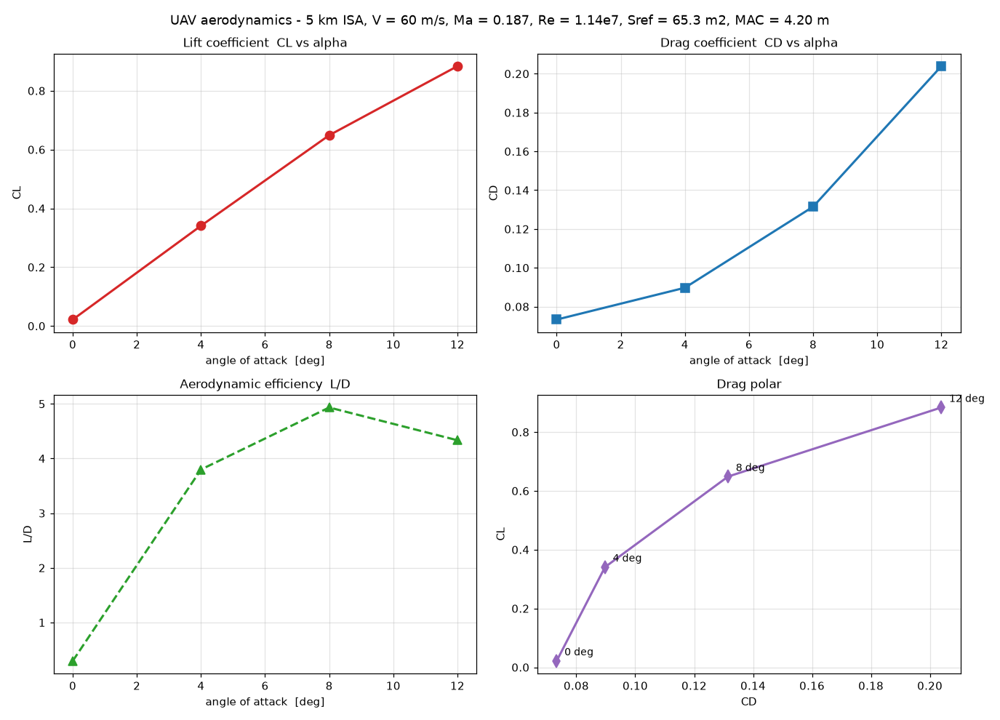

#### ① 怎么做出来的

- 数据源：`results/forces.json`（`final_solve.py` 在每个攻角迭代结束后写入）
- 脚本：`scripts/04_post/render_post.py :: fig_coeffs()`
- 2×2 子图：`C_L`–α（红 ○）、`C_D`–α（蓝 □）、`L/D`–α（绿 △）、**极曲线** `C_L`–`C_D`（紫 ◇，每点标注攻角）
- 力的取法：Fluent `report_definitions.force` 定义 `L`/`D`，
  `force_vector` 分别取风轴方向 $(-\sin\alpha,0,\cos\alpha)$ 与 $(\cos\alpha,0,\sin\alpha)$，
  用 `rd.compute(report_defs=["L","D"])` 求值；
  分区只取 `aircraft-fluid_box`（机体流体侧壁面），
  **不含**已删除的内腔，也**不含**远场盒子。

#### ② 图里看什么

| 子图 | 读法 |
| --- | --- |
| C_L–α | 中段直线的**斜率** = 升力线斜率；曲线末端是否"掉头" = 失速 |
| C_D–α | 小攻角近似水平（= C_D0）；大攻角上翘（诱导阻力 + 分离阻力） |
| L/D–α | 峰值对应的攻角 = **最佳巡航攻角** |
| 极曲线 C_L–C_D | 曲线越靠左上越好；从原点作切线，切点 = 最大 L/D |

#### ③ 物理含义与推导

见 §2.2（定义）、§2.5（升力线斜率）、§2.6（极曲线分解与最佳 L/D）。

本例读出的量：

| 量 | 值 | 理论/参考 |
| --- | ---: | --- |
| $C_{L,\alpha}$ | 4.490 /rad（0.0784 /deg） | Prandtl 理论 5.093 /rad → 比值 0.882 |
| $C_L(\alpha=0)$ | 0.0218 | 小正弯度（体素重建可能有微小不对称） |
| $\alpha_{L=0}$ | −0.30° | $=-C_L(0)/C_{L,\alpha}$ |
| $C_{D,0}$（拟合） | 0.0699 | 典型无人机 0.02–0.03 → **高估** |
| $k$（拟合） | 0.1660 | 理论（e=0.8）0.0465 → **高估 3.6×** |
| Oswald e | 0.224 | 典型 0.75–0.85 → 数值误差信号 |
| $(L/D)_{\max}$ | **4.93 @ α = 8°** | 拟合预测 4.64 @ C_L = 0.649 |
| $C_L^{*}$（最佳） | 0.6487 | $=\sqrt{C_{D,0}/k}=0.649$ ✓ 自洽 |

#### ④ 反映的性能

- **升力能力**：整机在 12° 时 C_L = 0.884 仍线性上升 → 未失速，
  说明该布局（AR 8.56 的大展弦比翼）失速攻角 > 12°；
- **巡航效率**：$L/D_{\max}=4.93$ —— 直接决定航程（$R\propto L/D$，见 §2.10）；
- **爬升/机动**：$C_L$ 线性段长 → 可用升力范围宽；
- **配平**：由 $V=\sqrt{2mg/(\rho S C_L)}$ 可反推任意质量下的配平速度与攻角。

#### ⑤ 工程应用

| 应用 | 怎么用这张图 |
| --- | --- |
| **任务剖面设计** | 取 $L/D_{\max}$ 点定巡航速度；取 $C_L^{3/2}/C_D$ 最大点定**久航**速度 |
| **发动机选型** | $P = mgV/(\eta\,L/D)$，配 §2.10 表 |
| **飞控律设计** | $C_L$–α 线性段 → 迎角-升力增益；非线性段 → 需限制迎角 |
| **失速保护** | 需补算 α > 12° 找到 $C_{L,\max}$，据此设迎角限位 |
| **设计迭代** | 换翼型/改后掠后重跑同一张图，直接对比曲线移动 |

---

### 3.2 `residuals.png` —— 收敛史

**文件**：1 张（全局）

**图像** — 收敛史

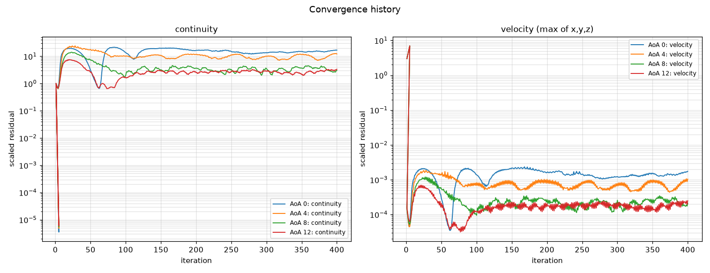

#### ① 怎么做出来的

- 数据源：`logs/final5.log`（`render_post.py :: fig_residuals()` 用正则解析 Fluent 残差表）
- 内容：连续性残差（左）、速度残差最大值（右），4 个攻角各一条曲线

#### ② 图里看什么

- 曲线**单调下降** → 收敛；**平台** → 达到稳态或残差极限；
- 是否出现"锯齿"或"反弹" → 松弛过激（本次正是靠降低显式松弛解决的）。

#### ③ 物理含义

残差是离散方程的**不平衡量**。以连续方程为例，每个单元的残差：

$$
R_c = \sum_{f} (\rho \mathbf{u}\cdot\hat{\mathbf{n}} A)_f
$$

Fluent 报告的通常是**归一化均方根**（除以最初几步的参考值）。
本次关键设置（这是从发散到收敛的分水岭）：

| 参数 | Fluent 默认 | 本次采用 | 效果 |
| --- | ---: | ---: | --- |
| `explicit_pressure_under_relaxation` | 0.75 | **0.4** | 抑制压力场过冲 |
| `explicit_momentum_under_relaxation` | 0.75 | **0.5** | 抑制动量场过冲 |

判定收敛的三个**物理**证据（比残差更可靠）：

1. 域内平均压力回到 **54 025 Pa**（远场 54 019.9 Pa，误差 0.01%）；
2. 侧向力 $|F_y| < 0.5\%\,L$（对称性成立）；
3. 载荷在最后 150 步波动 < 1%（见 `forces.json` 的 `history`）。

#### ④ 反映的性能

不直接反映飞机性能，但**决定所有其他结果是否可信**。

#### ⑤ 工程应用

- 判断能否用这批数据出报告；
- 若残差平台在 O(1)，需检查：网格质量、松弛、边界条件、是否有非物理区域（本次是机体内腔）。

---

### 3.3 `cp3d_surf_aoa*_{planform,side,front}.png` —— 三维表面压力云图

**文件**：12 张（4 攻角 × 3 视角）

**图像** — 三维表面 C_p 云图（每攻角三视角：俯视 / 侧视 / 前视）

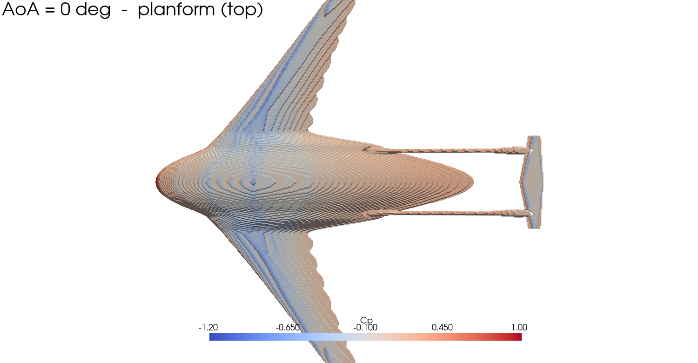 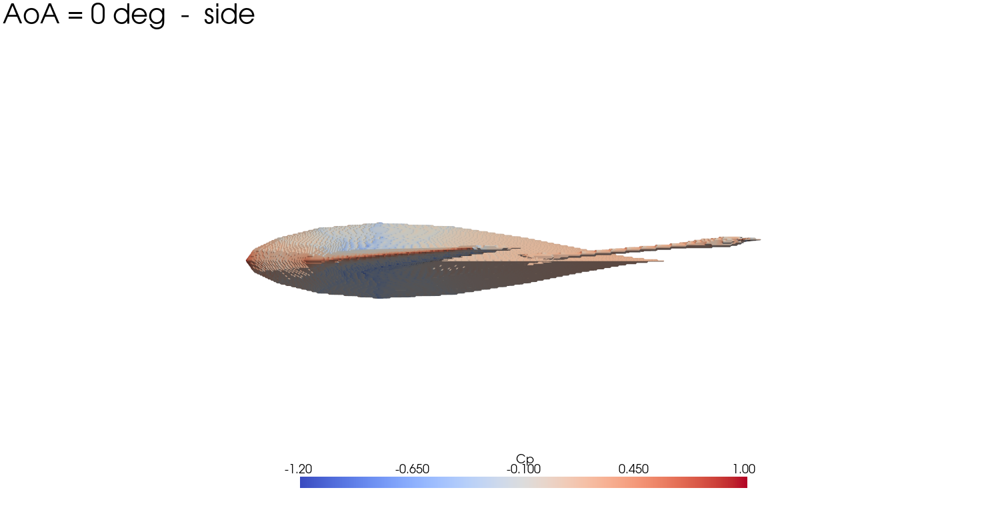 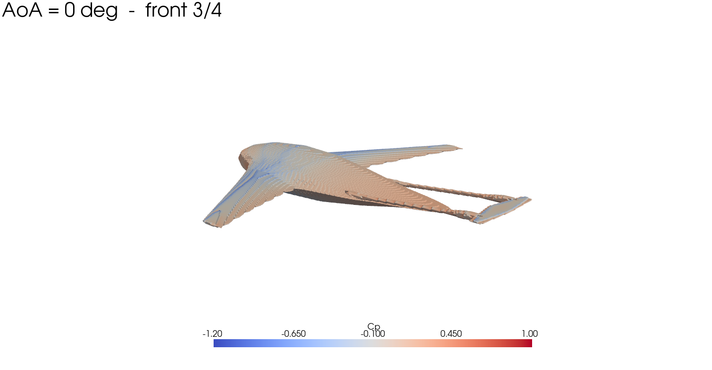

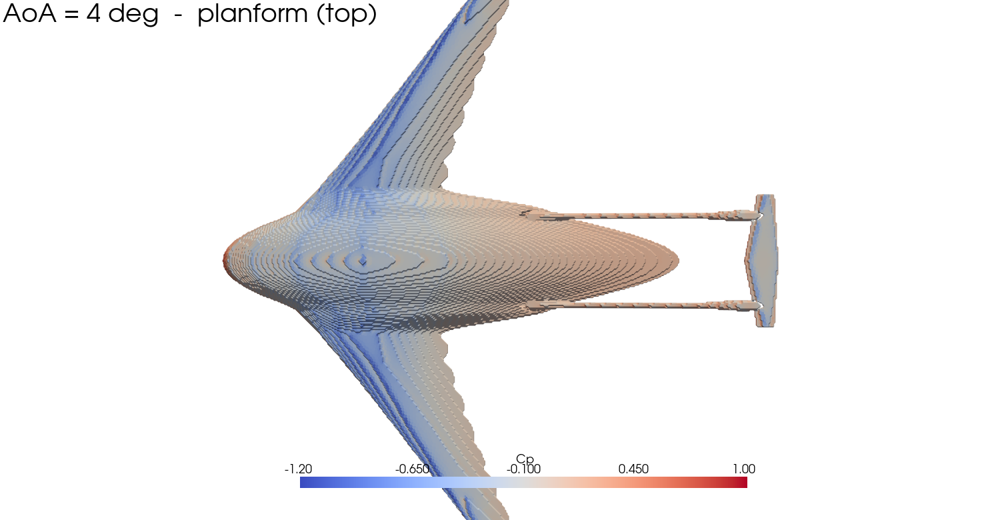 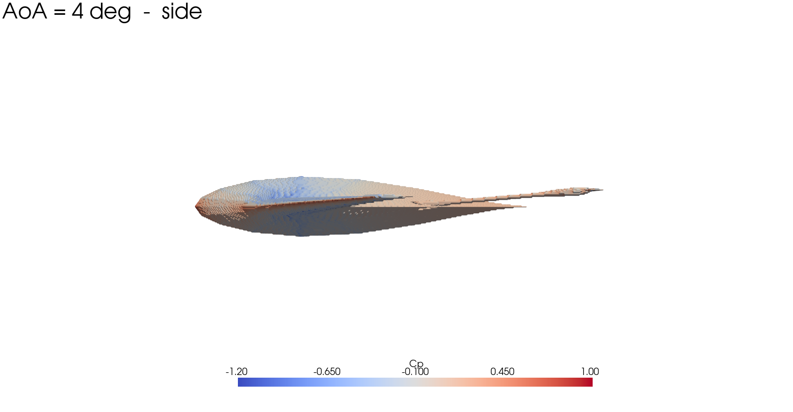 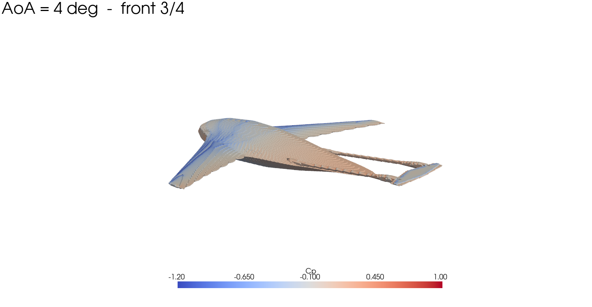

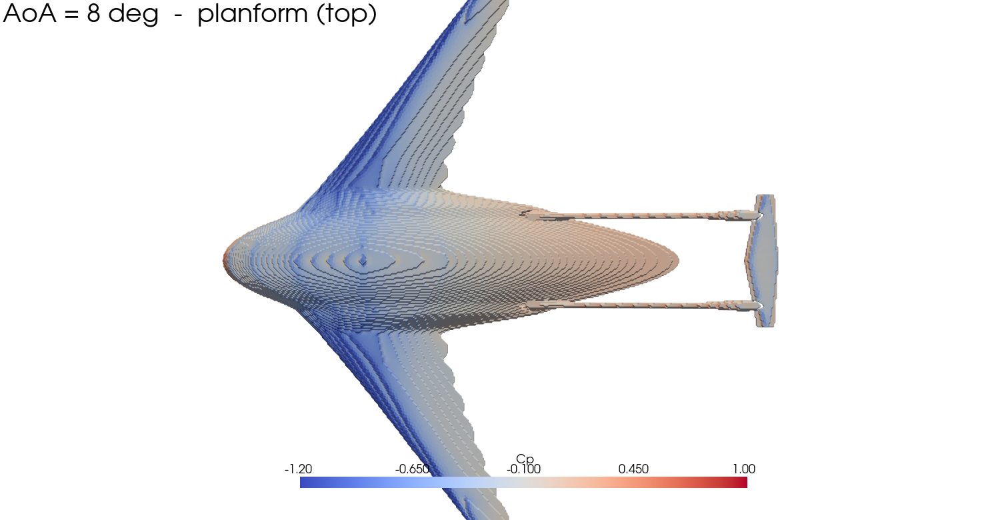 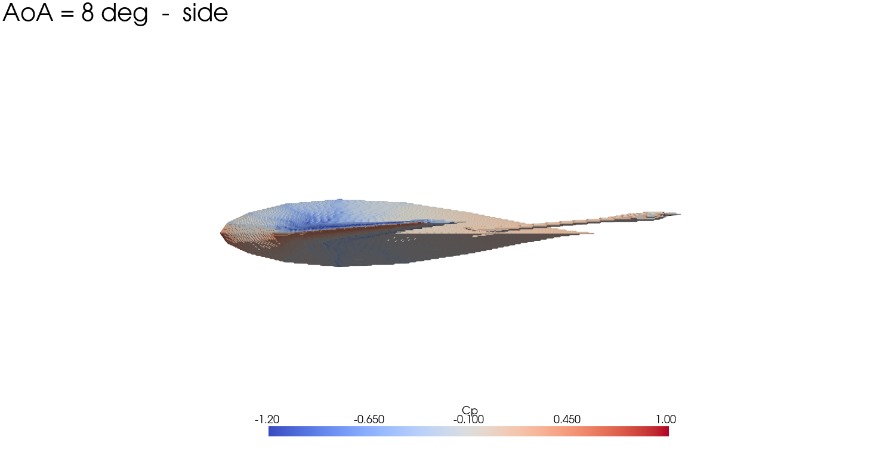 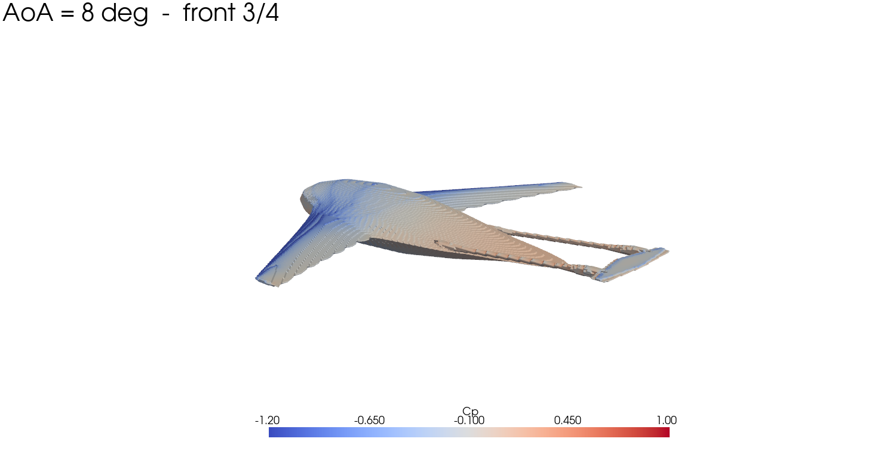

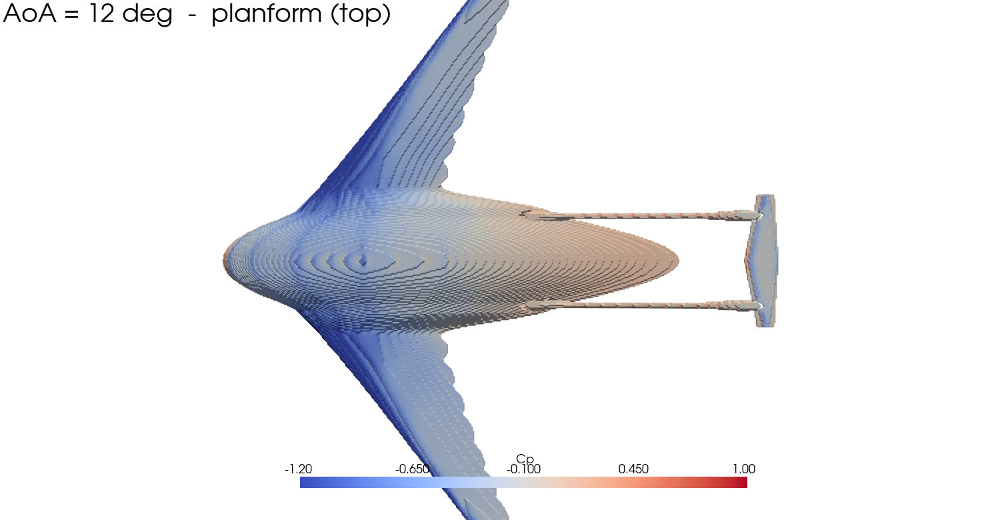 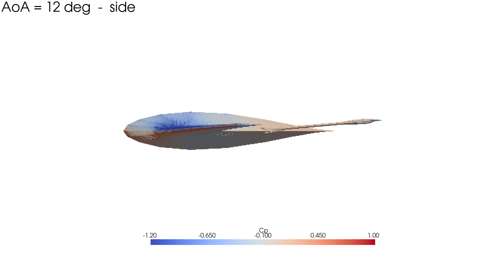 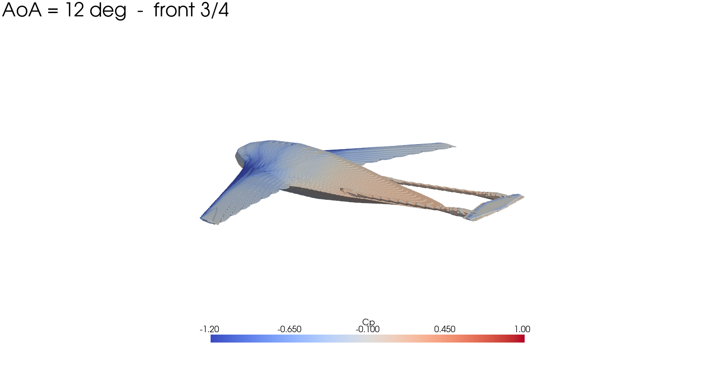

#### ① 怎么做出来的

- 数据：`wall_verts` / `wall_conn` / `wall_p`（压力**节点值**）
- 转换：$C_p = (p - p_\infty)/q_\infty$，$p_\infty = 54\,019.89$ Pa，$q_\infty = 1325.016$ Pa
- 渲染：`pyvista` 离屏 (`off_screen=True`)，窗口 1500×780，白底
- 色标：`coolwarm`，**固定范围 $C_p \in [-1.2,\ +1.0]$**（四个攻角同一色标 → 可直接比较）
- 相机（位置 / 焦点 / 上方向）：

| 视角 | camera_position |
| --- | --- |
| planform（俯视） | `[(12, 0, 42), (12, 0, 0), (0, 1, 0)]` |
| side（侧视） | `[(12, -46, 0), (12, 0, 0), (0, 0, 1)]` |
| front（前视/等轴） | `[(42, -33, 14), (12, 0, 0), (0, 0, 1)]` |

- 网格：`vtkmesh()` 把 Fluent 的多边形连接表转成 VTK 单元

#### ② 图里看什么

| 颜色 | 含义 |
| --- | --- |
| **红（暖）** | $C_p > 0$，高压 —— 迎风面、驻点、下翼面 |
| **蓝（冷）** | $C_p < 0$，吸力 —— 上翼面、加速区 |
| 接近白 | $C_p \approx 0$，与来流同压 |

读图要点：

1. **机头驻点**应是最红的一点（$C_p \to +1$）；
2. **上翼面前缘**应是最蓝的一条带（吸力峰）；
3. 随攻角增大，蓝色带应**变宽变深**并向**前缘**集中；
4. 三视角交叉验证：俯视图看展向分布（是否等载荷）、侧视图看弦向分布、前视图看左右对称性。

#### ③ 物理推导

由 §2.2：$C_p = 1 - (V/V_\infty)^2$。机翼上表面流速高 → $C_p < 0$ → 吸力 → **升力的主要来源**。
升力是上下表面压力差沿表面的积分：

$$
L = \oint_{\text{wall}} (-p\,\hat{\mathbf{n}})\cdot\hat{\mathbf{e}}_L\,\mathrm{d}A
$$

无量纲化后即 $C_L$。因此**这张云图就是升力的"来源地图"**。

#### ④ 反映的性能

| 现象 | 反映的性能 |
| --- | --- |
| 上表面吸力峰强度 | 升力能力、前缘载荷 |
| 吸力峰位置（越靠前缘越强） | 前缘吸力 → 影响失速特性 |
| 展向颜色均匀性 | 展向载荷分布（是否接近椭圆 → 影响 e） |
| 左右对称 | 加工/建模对称性、侧滑为零 |
| 尾翼颜色 | 平尾是否产生配平负升力 |

#### ⑤ 工程应用

- **结构载荷**：把 $C_p$ 乘 $q_\infty$ 得局部压强，直接作为翼面/蒙皮的**分布气动载荷**输入到结构有限元（本工作区已有 `ansys-mapdl-fea` 技能，可无缝衔接）；
- **翼面开口/口盖布置**：避开高吸力区（否则口盖会被吸开）；
- **层流/转捩设计**：顺压梯度区（$C_p$ 沿流向下降）可维持层流 → 减阻；
- **结冰/防冰**：驻点区（$C_p \to 1$）是结冰最严重处 → 确定加热区。

---

### 3.4 `cp_upper_lower_aoa*.png` —— 上下表面 C_p 分布

**文件**：4 张（每攻角 1 张，左右两幅）

**图像** — 上下表面 C_p 分布

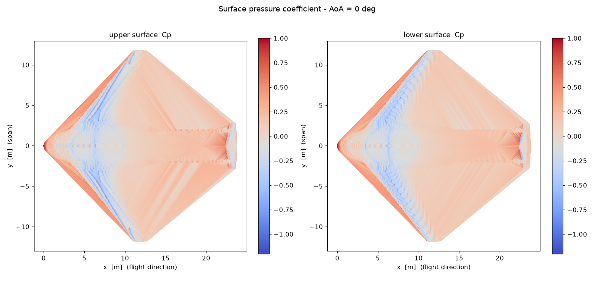 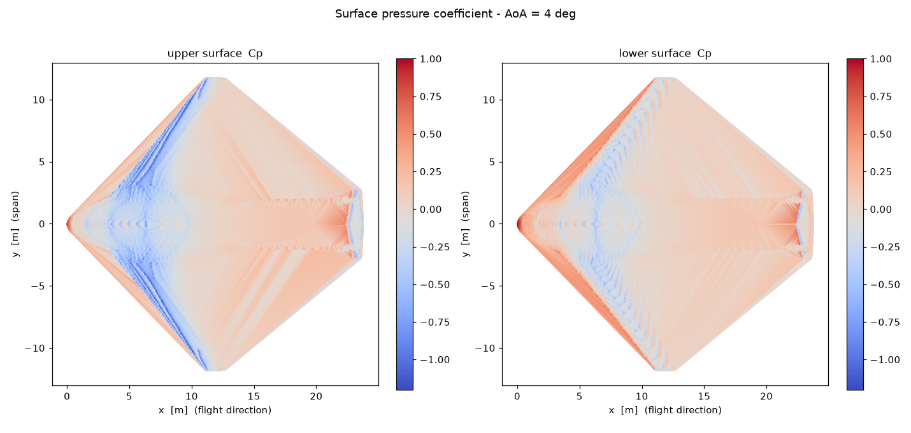

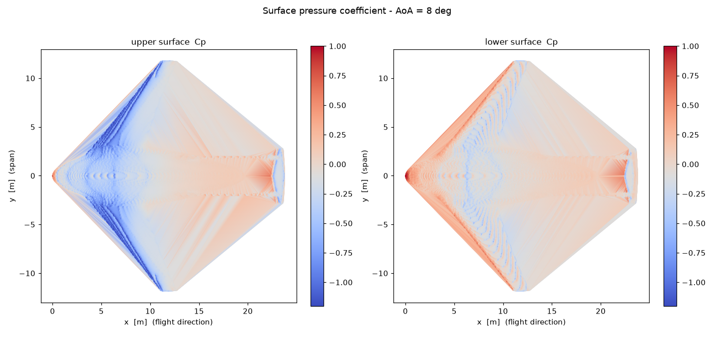 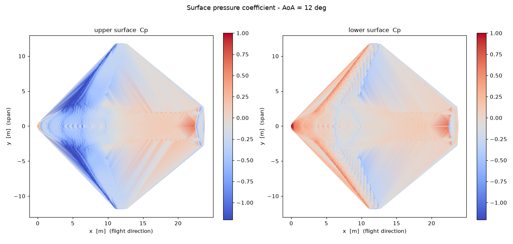

#### ① 怎么做出来的

- 数据：`wall_pf`（压力**面值**，用于 flat 着色）、`wall_nrm`（面法向）
- **关键一步**：Fluent 返回的法向是**面积加权未归一化**的（模长 ≈ 0.0015），
  必须先归一化：$ \hat{\mathbf{n}} = \mathbf{n}/\|\mathbf{n}\| $
- **上下表面判据**（实测标定）：Fluent 壁面法向**指向流体内部**，故

$$
\text{上表面} \iff n_z < -0.15,\qquad \text{下表面} \iff n_z > +0.15
$$

  验证数据：满足 $n_z < 0$ 的面平均高度 $z = +0.64$ m 且携带吸力 —— 确认是上表面。

- 投影：取面心 $(x, y)$，用 `matplotlib.tripcolor(..., shading="gouraud")` 绘制
  （注意：**不能用 `tricontourf`**，多面体面扇形三角化会产生病态三角形，会卡死 >30 min）
- 色标：`coolwarm`，$C_p \in [-1.2, +1.0]$

#### ② 图里看什么

- 横轴 x（流向）、纵轴 y（展向），两幅分别是上/下表面；
- **上表面**应整体偏蓝；**下表面**应整体偏红；
- 两幅的**差值**就是升力；
- 机翼后掠 40.65° → 蓝色带应沿展向后移。

#### ③ 物理推导

沿弦向积分得到翼型的升力系数（二维）：

$$
c_l = \int_0^1 \bigl(C_{p,\text{lower}} - C_{p,\text{upper}}\bigr)\,\mathrm{d}(x/c)
$$

这就是经典的**翼型压强分布环积分**——两条曲线之间的**面积**即升力。

本例实测（整机体表面）：

| α [°] | 上表面主导 | $C_p$ 极值 | 对应 $C_L$ |
| ---: | --- | ---: | ---: |
| 0 | 差异很小 | −1.12 | 0.022 |
| 4 | 上表面明显吸力 | −1.25 | 0.341 |
| 8 | 强吸力带 | −2.00 | 0.649 |
| 12 | 前缘吸力峰集中 | **−2.73** | 0.884 |

#### ④ 反映的性能

- **升力产生机制**：定量给出"多少来自上表面吸力、多少来自下表面高压"；
- **载荷沿展向分布** → 判断是否为椭圆载荷 → 影响诱导阻力与 e；
- **吸力峰位置** → 判断是否接近前缘分离（吸力峰过后强逆压梯度 → 分离）；
- **12° 时吸力峰达 −2.73**（局部速度 1.93 V∞）→ 强逆压梯度 → 与观察到的分离一致。

#### ⑤ 工程应用

- **翼型选型/修形**：对比不同翼型的压强环面积与吸力峰形状；
- **襟翼/副翼设计**：确定铰链线位置（应在压强平缓区）、估算铰链力矩；
- **翼梁布置**：压力中心（环积分的形心）位置决定翼梁受力；
- **压力中心移动**：$x_{cp}$ 随 α 移动 → 影响纵向配平与操纵力。

---

### 3.5 `sym_fields_aoa*.png` —— 对称面流场

**文件**：4 张（每攻角 1 张，上下两幅）

**图像** — 对称面 y=0 流场（上：速度幅值；下：C_p）

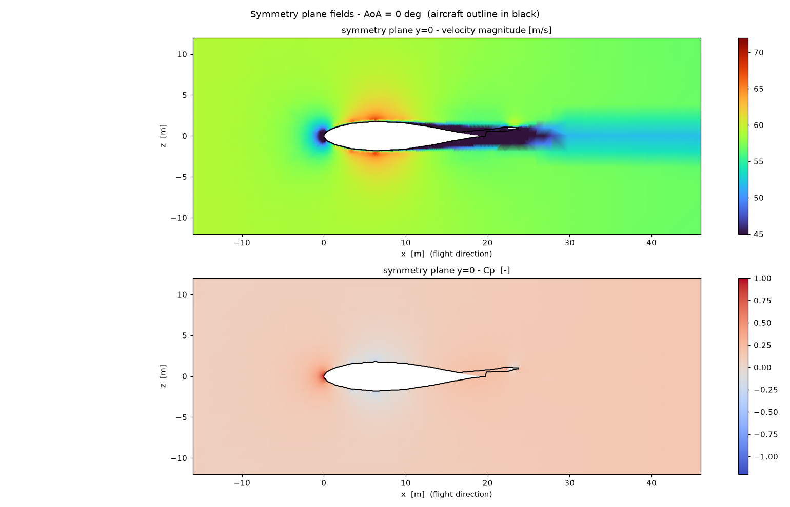 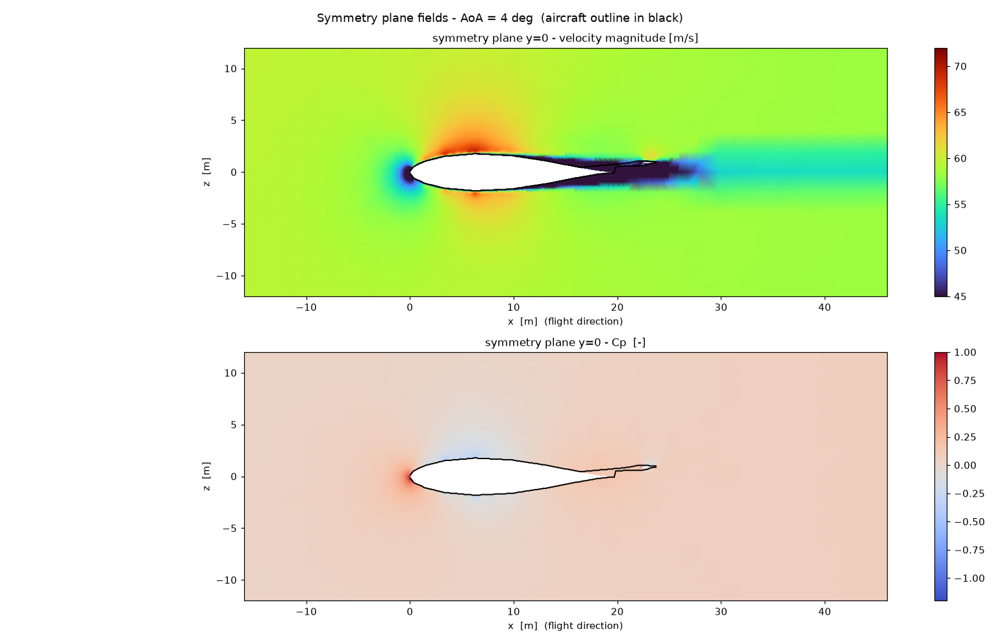

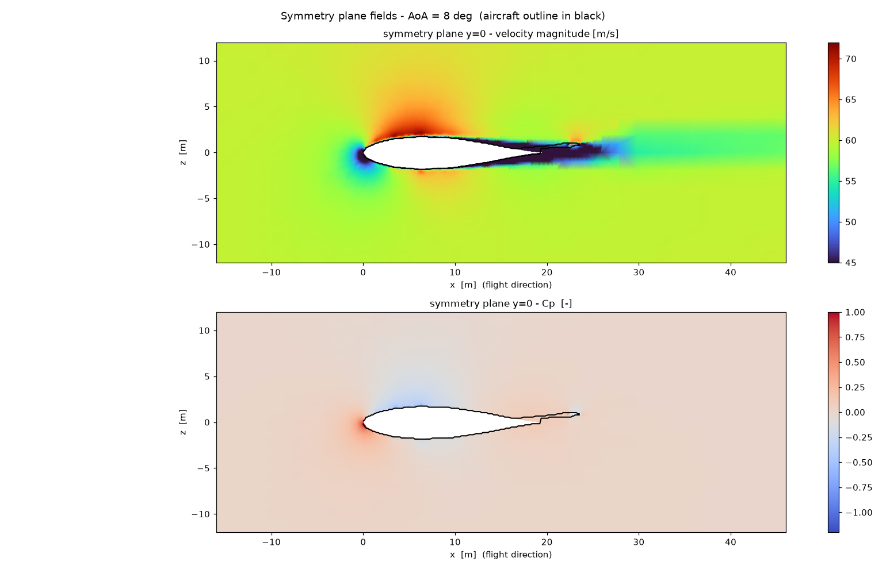 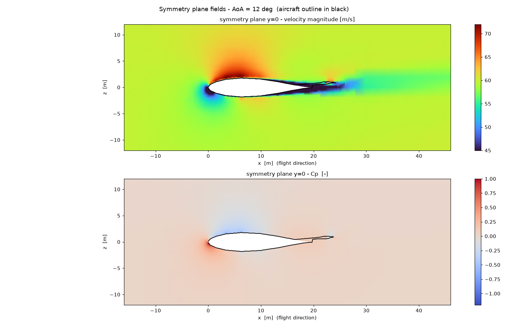

#### ① 怎么做出来的

- 切面：`sym_y0`（`zx-plane`, y = 0），即过机体中心、展向为 0 的平面
- 数据：`sym_velocity_magnitude`（上幅）、`sym_pressure` → 转 $C_p$（下幅）
- 渲染：`tripcolor` + gouraud 着色，投影轴 $(x, z)$
- 色标：速度 `turbo` **45–72 m/s**；$C_p$ `coolwarm` **−1.2 → +1.0**
- 坐标范围：$x \in [-16, 46]$ m，$z \in [-12, 12]$ m
- **黑色轮廓线**：从 `artifacts/geometry/aircraft_solid.stl` 取 $y \approx 0$ 切片，
  分上下两条包络线（`slice_y0()`，容差 0.12 m）

#### ② 图里看什么

| 要素 | 含义 |
| --- | --- |
| 机体上方蓝色加速区 | 上翼面吸力 → 升力来源 |
| 机头前方红色 | 驻点高压 |
| 机体下方橙红 | 下表面高压 |
| 尾流区（机体后方） | 速度亏损（蓝色带）→ 型阻 + 诱导阻力 |
| 上下幅对照 | 同一处"速度高"必对应"$C_p$ 低"（伯努利） |

#### ③ 物理推导

沿流线的伯努利关系（§2.2）在这张图上可**逐点验证**：
速度 45 m/s → $C_p = 1-(45/60)^2 = +0.44$；速度 72 m/s → $C_p = 1-(72/60)^2 = -0.44$。
色标上下限 ±0.44 附近 → 与 $C_p$ 图的 −1.2…+1.0 范围相容。

**尾流亏损与型阻**：尾流中的动量亏损等于阻力（在控制面上积分）：

$$
D = \rho\int_{\text{wake}} u\,(V_\infty - u)\,\mathrm{d}A
$$

因此**机体后方蓝色尾流带的宽度与深度，就是阻力大小的直接可视化**。

#### ④ 反映的性能

- **升力机制**：上表面加速最强处 = 最大升力贡献处；
- **阻力来源**：尾流亏损厚度 → 压差阻力（型阻）；
- **流动分离**：尾流带突然增宽 → 分离（12° 时应在机翼后方看到明显加宽）；
- **机身干扰**：机身与机翼交界处是否有堵塞/分离；
- **尾撑与平尾的洗流**：平尾位于尾涡/下洗中 → 影响配平与稳定性。

#### ⑤ 工程应用

- **减阻**：尾流带越窄越好 → 指导整流罩、翼身融合修形；
- **发动机/进气口布置**（本机是推进式，螺旋桨在后）→ 看尾流是否打到螺旋桨盘面；
- **尾翼位置**：从下洗场判断平尾/垂尾的当地迎角（平尾效率）；
- **舱内/设备散热**：表面高压区与低压区决定泄流路径。

---

### 3.6 `sym_streamlines_aoa*.png` —— 对称面流线

**文件**：4 张

**图像** — 对称面流线（按 |V| 着色）

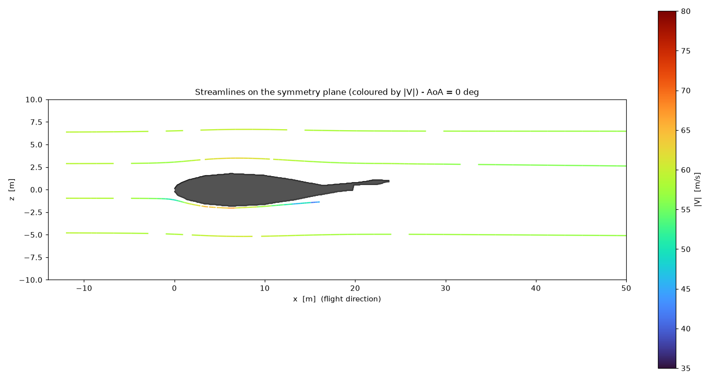 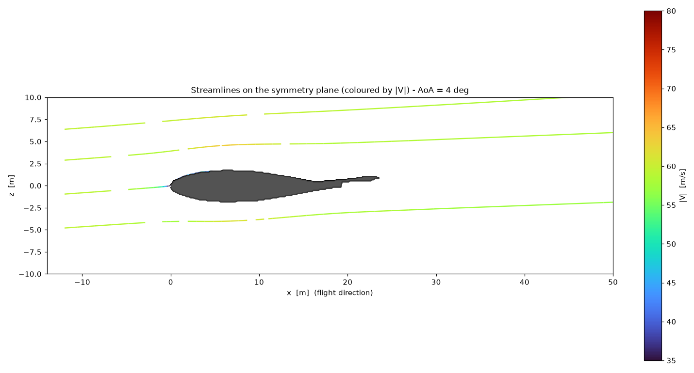

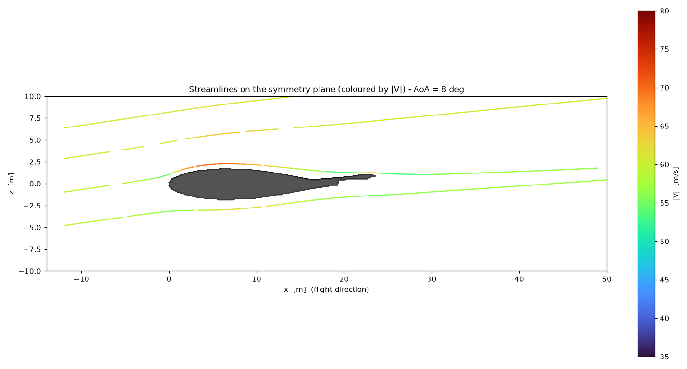 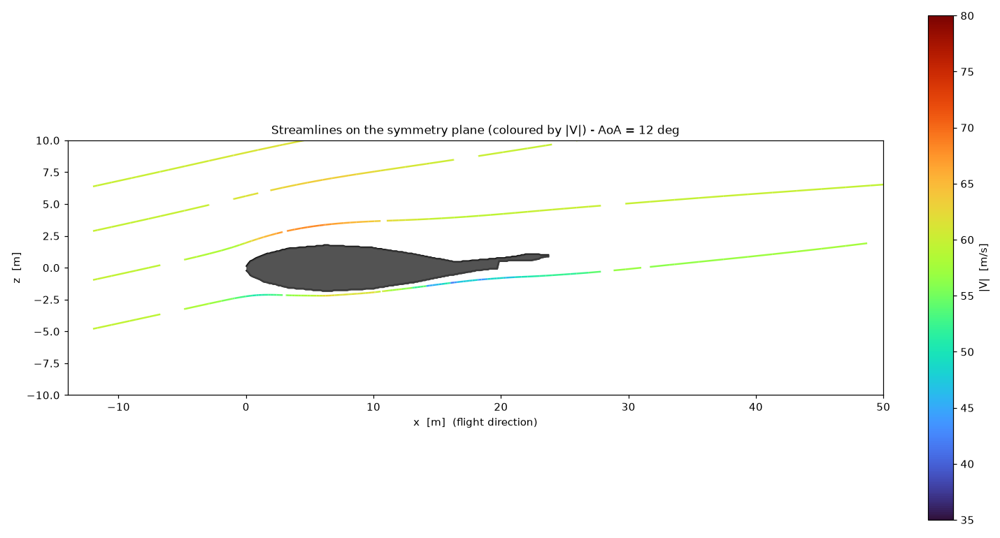

#### ① 怎么做出来的

- 种子线：`seed_line` = $(-12, 0, -7) \to (-12, 0, 7)$，位于机体**上游 12 m**、竖直跨 ±7 m
- 积分：`PathlinesFieldDataRequest(steps=230, step_size=0.35, accuracy_control_on=True, tolerance=0.001)`
  → 积分长度约 $230\times0.35 = 80$ m，足以覆盖整个计算域
- 着色：按当地 $|V|$ 用 `turbo`，归一化范围 **35–80 m/s**
- 渲染：`LineCollection` 逐段着色，机体轮廓用黑色填充
- 坐标范围：$x\in[-14, 50]$，$z\in[-10,10]$，等比例

#### ② 图里看什么

| 现象 | 含义 |
| --- | --- |
| 流线在机头**分叉** | 驻点；上方流向机身上表面，下方流向下表面 |
| 机身上方流线**密集/加速** | 吸力峰 |
| 后缘处流线**汇合** | Kutta 条件（后缘速度有限） |
| 尾流区流线**偏转**（向下） | **下洗**（诱导阻力的来源） |
| 流线在某处**离开壁面/回卷** | **流动分离** |
| 流线在远场**恢复水平** | 扰动已衰减，远场边界设置合理 |

#### ③ 物理推导

流线是速度场的积分曲线，满足

$$
\frac{\mathrm{d}\mathbf{x}}{\mathrm{d}s} = \frac{\mathbf{u}(\mathbf{x})}{|\mathbf{u}(\mathbf{x})|}
$$

稳态下**流线 = 迹线 = 烟线**，因此这张图等价于风洞烟线显示。

**后缘下洗**来自 §2.5 的诱导速度：椭圆载荷下 $w = V C_L/(\pi \mathrm{AR})$。

| C_L | 理论下洗 w（V=60 m/s） | 对应下洗角 |
| ---: | ---: | ---: |
| 0.3408 | 0.76 m/s | 0.73° |
| 0.6487 | **1.45 m/s** | **1.38°** |
| 0.8836 | 1.97 m/s | 1.88° |

在图上表现为：机体后方流线整体向下倾斜约 1.4°–1.9°。

#### ④ 反映的性能

- **分离起始攻角**：流线何时在后缘以外离开壁面；
- **下洗角** → 诱导阻力与尾翼当地迎角；
- **驻点位置** → 机头/进气布置；
- **流管收缩** → 局部加速与最大速度。

#### ⑤ 工程应用

- **失速诊断**：定位分离起始站位 → 指导前缘缝翼/涡流发生器布置；
- **平尾设计**：下洗角直接改变平尾迎角（$\alpha_H = \alpha - \varepsilon + i_H$），
  是纵向静稳定的关键输入；
- **进气道/排气**：本机推进式布局，看螺旋桨盘面处的来流是否均匀；
- **空速管/迎角传感器位置**：应选在流线稳定、受机体干扰小的位置（如机头前方）。

---

### 3.7 `vortex3d_aoa*.png` —— 三维翼尖涡

**文件**：4 张

**图像** — 三维翼尖涡流线

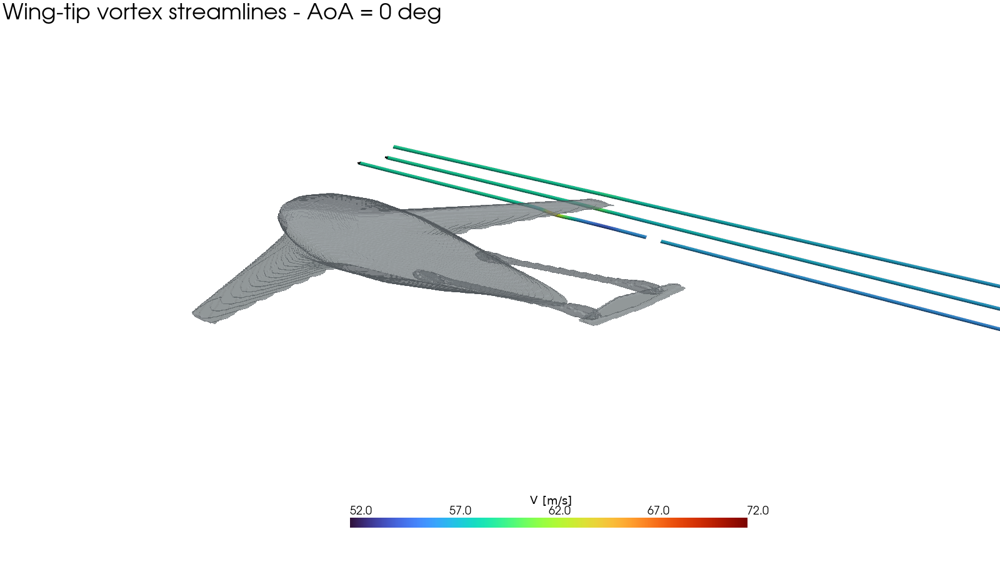 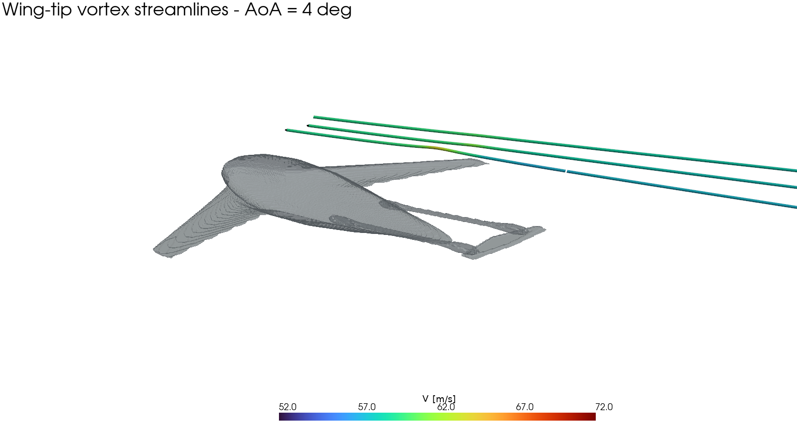

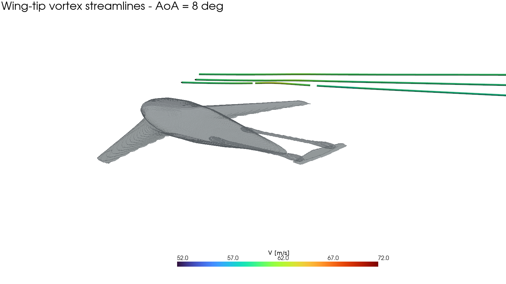 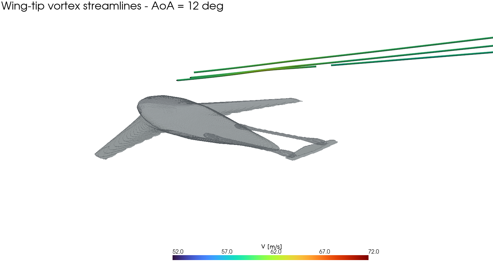

#### ① 怎么做出来的

- 种子线（放在**上游** $x=-6$ m，让流线自然卷起）：

| 种子 | 起止点 | 覆盖展向 |
| --- | --- | --- |
| `seed_tip` | (−6, 9.4, 0) → (−6, 11.9, 0) | **翼尖**（翼尖在 y = 11.82 m） |
| `seed_tip2` | (−6, 11.9, 0.6) → (−6, 12.8, 0.6) | 翼尖外侧 |
| `seed_mid` | (−6, 3.0, 0.2) → (−6, 7.0, 0.2) | 中段翼展 |

- 积分：同 §3.6（steps=230, step_size=0.35）
- 渲染：`pyvista`，半透明机体（灰，opacity 0.55）+ 彩色流线管
  - **必须用 `.lines` 属性**（`pv.PolyData(points, cells)` 会把 2 点单元当成 polys 而不渲染）
  - `render_lines_as_tubes=True`，线宽 5
  - 色标 `turbo`，**clim = [52, 72] m/s**（突出涡核的高速旋转）
  - 相机 `[(46, -30, 15), (16, 0, 0), (0, 0, 1)]`，窗口 1600×900，白底

#### ② 图里看什么

| 现象 | 含义 |
| --- | --- |
| 翼尖处流线**螺旋卷绕** | 翼尖涡核 |
| 涡核**向下游延伸**并逐渐变淡 | 尾涡输运与粘性衰减 |
| 涡核位置向**内侧下方**移动 | 涡对互相诱导下洗 |
| 中段流线基本**平直** | 二维区，涡量集中在翼尖 |
| 涡核颜色接近色标上限 | 涡核内切向速度高 |

#### ③ 物理推导

**翼尖涡的形成**：翼尖处下表面高压流体绕过翼尖翻到上表面 →
形成沿流向的集中涡，其环量等于翼根环量 Γ₀（§2.5）：

$$
\Gamma_0 = \frac{4L}{\rho V \pi b}
$$

| C_L | L [N] | Γ₀ [m²/s] |
| ---: | ---: | ---: |
| 0.3408 | 29 504 | 35.97 |
| 0.6487 | 56 160 | **68.47** |

**Lamb–Oseen 涡模型**（§2.7）：

$$
V_\theta(r) = \frac{\Gamma_0}{2\pi r}\left(1 - e^{-r^2/r_c^2}\right)
$$

以 Γ₀ = 68.5 m²/s、核半径 $r_c = 0.5$ m 估算最大切向速度（$r\approx1.12 r_c = 0.56$ m）：

$$
V_\theta \approx \frac{68.5}{2\pi\times0.56}(1-e^{-0.56^2/0.5^2})
= 19.5\times(1-0.285) = \mathbf{13.9\ m/s}
$$

这与色标上限（72 m/s = 60 + 约 12 m/s 的切向叠加）**量级一致** ✓。

**涡对的互相诱导**：两个反向旋转的涡（左右翼尖）间距 b，互相诱导下沉速度

$$
w_{\text{pair}} = \frac{\Gamma_0}{2\pi b} = \frac{68.5}{2\pi\times23.64} = \mathbf{0.46\ m/s}
$$

（远场尾涡的下沉速度，用于尾流间隔标准。）

#### ④ 反映的性能

- **诱导阻力的可视化根源**：翼尖涡越强 → 下洗越大 → 诱导阻力越大；
- **展向载荷**：涡核越集中 → 载荷越接近椭圆 → e 越高；
- **大展弦比的效果**：AR 8.56 使涡核相对远离翼面 → 诱导阻力较低；
- **翼尖装置效果评估**：翼尖小翼/斜削翼尖会**打散**涡核 → 图上应看到涡被削弱/分裂。

#### ⑤ 工程应用

| 应用 | 说明 |
| --- | --- |
| **翼尖小翼设计** | 对比加装前后的涡核强度与 Γ₀ → 直接量化减阻收益 |
| **尾流间隔（ATC）** | Γ₀ 决定后机遭遇的滚转力矩 → 起飞/着陆间隔标准（重型机尾涡最危险） |
| **编队飞行** | 后机可利用前机翼尖涡的**上洗区**省油（需精确知道涡核轨迹） |
| **无人机空中回收/加油** | 涡核位置决定安全的接近走廊 |
| **螺旋桨/旋翼干扰** | 本机为推进式，需确认螺旋桨不吸入强涡核（避免振动与效率损失） |

---

### 3.8 `wake_xsections_aoa*.png` —— 尾涡横截面

**文件**：4 张（每攻角 1 张，5 个站位并排）

**图像** — 尾涡横截面（x = 8/15/24/34/48 m，涡量幅值）

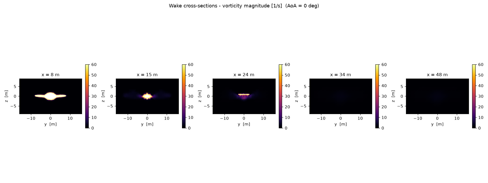 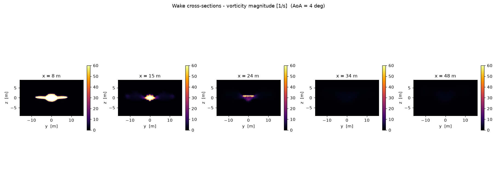

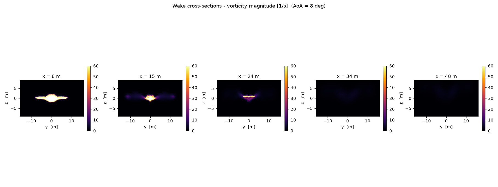 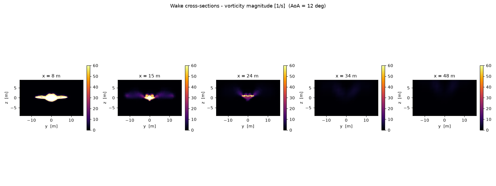

#### ① 怎么做出来的

- 切面：`yz-plane`，站位 **x = 8 / 15 / 24 / 34 / 48 m**
  （机体 x 范围 0 → 24.04 m，故 8/15/24 在机体上，34/48 在下游尾流中）
- 场：`xs*_vorticity_mag`（涡量幅值 $|\boldsymbol\omega|$，首选）
- 色标：`inferno`，范围 **0–60 s⁻¹**
- 投影：$(y, z)$，范围 $y\in[-16,16]$ m，$z\in[-9,9]$ m

> 注：抽取时同时取了 `q-criterion`，可用于$ Q>0 $ 判据的涡核识别（§2.7）。

#### ② 图里看什么

| 站位 | 应看到 |
| --- | --- |
| x = 8 m（机翼中段） | 翼面上方高涡量薄层（边界层）+ 翼尖处初步卷起 |
| x = 15 m（机翼后段） | 翼尖涡开始成形 |
| x = 24 m（机尾） | **两个明亮涡核**位于 y ≈ ±11 m（翼尖附近），略向内下方移动 |
| x = 34 m | 涡核继续扩散变淡，向内侧靠拢 |
| x = 48 m（远下游） | 涡核明显耗散、半径增大 |

#### ③ 物理推导

涡量幅值：$\omega = |\nabla\times\mathbf{u}|$。在尾涡横截面上，
涡核处的涡量峰值（Lamb–Oseen）：

$$
\omega_{\max} = \frac{\Gamma_0}{\pi r_c^2}\cdot(1-e^{-1}) \approx 0.632\frac{\Gamma_0}{\pi r_c^2}
$$

以 Γ₀ = 68.5 m²/s、$r_c = 0.5$ m：$ \omega_{\max} \approx 0.632\times68.5/(\pi\times0.25) = \mathbf{55\ s^{-1}} $

→ **正好落在色标上限 60 s⁻¹ 附近** ✓，说明色标选择合理，涡核清晰可辨。

**涡核耗散**：粘性扩散使 $r_c^2 \propto t$（层流）：

$$
r_c(x) \approx \sqrt{r_{c0}^2 + \frac{4\nu\,(x-x_0)}{V}}
$$

$\nu = \mu/\rho = 2.21\times10^{-5}$ m²/s，从 x=24 到 x=48（Δx = 24 m，飞行时间 0.4 s）：

$$
\Delta r_c^2 = 4\times2.21\times10^{-5}\times0.4 = 3.54\times10^{-5}\ \text{m}^2 \ll r_{c0}^2
$$

→ **分子粘性造成的扩散极小**；实际观察到的扩散主要来自
**湍流粘性（$\nu_t \gg \nu$）与数值耗散**——这提醒我们：
尾涡在粗网格上会**人为过快衰减**，正是 §2.6 中 e 偏小的原因之一。

#### ④ 反映的性能

- **诱导阻力的空间演化**：涡核强度 × 间距 → 诱导阻力沿流向的变化；
- **尾涡危害半径**：涡核半径与强度决定后机遭遇的危险区；
- **网格充分性**：若 48 m 处涡核几乎消失 → 尾迹分辨率不足（本次确有此倾向）；
- **分离区范围**：涡量高的带状区域宽度 = 分离/尾流区范围。

#### ⑤ 工程应用

- **尾流间隔标准制定**：$r_c$ 与 Γ₀ 是 ICAO/军标尾流分类的直接输入；
- **尾流遭遇仿真**：把涡核参数喂给后机的飞控模型，评估滚转扰动；
- **网格自适应依据**：哪些站位需要加密 → 指导下轮网格划分（**本次最应加密的就是 x = 24–60 m 尾流区**）；
- **翼尖装置评估**：加小翼后涡核应分裂为多个弱涡 → 峰值 $|\omega|$ 下降。

---

### 3.9 `wake_horizontal_aoa*.png` —— 水平面尾迹

**文件**：4 张

**图像** — 水平面 z=0 尾迹

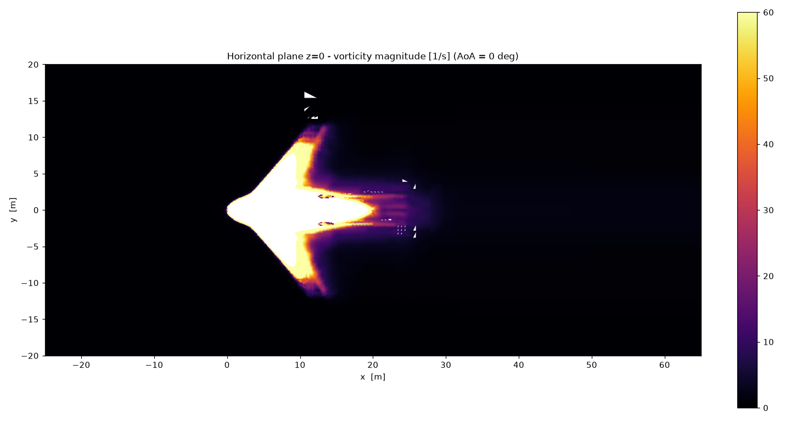 

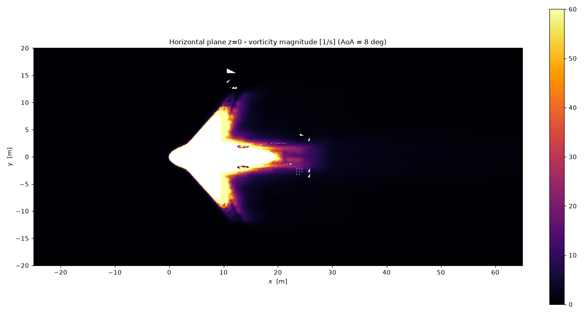 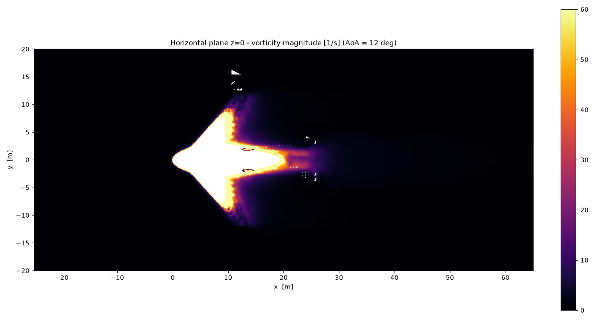

#### ① 怎么做出来的

- 切面：`hor_z0`（`xy-plane`, z = 0），过机翼弦线的水平面
- 场：`hor_vorticity_mag`（优先）或 `hor_velocity_magnitude`
- 色标：`inferno` **0–60 s⁻¹**
- 投影：$(x, y)$，范围 $x\in[-25,65]$ m，$y\in[-20,20]$ m

#### ② 图里看什么

| 现象 | 含义 |
| --- | --- |
| 两条从翼尖（y ≈ ±11.8）向后延伸的**亮带** | 左右翼尖涡的**轨迹** |
| 亮带向**内侧**收拢 | 涡对互相诱导（§3.7 的 $w_{\text{pair}}$） |
| 机体正后方中心的亮区 | 机身/尾撑尾流与分离 |
| 亮带下游变淡 | 耗散 |
| 亮带笔直 vs 摆动 | 稳态 vs 非稳态（本次稳态 → 应笔直） |

#### ③ 物理推导

翼尖涡对的轨迹：每个涡在另一个涡诱导的速度场中移动，
诱导速度 $w_{\text{pair}} = \Gamma_0/(2\pi b) = 0.46$ m/s（§3.7）。
飞行时间 $t = \Delta x/V$，涡对下沉量：

$$
\Delta z = w_{\text{pair}}\cdot t
$$

在 x = 48 m 处（从 x = 12 m 起，Δx = 36 m，t = 0.6 s）：

$$
\Delta z \approx 0.46\times0.6 = \mathbf{0.28\ m}
$$

同时涡对间距会缓慢收缩（相互诱导的水平分量），但量级很小。
→ 图上应看到两条**近似平行、略微内收**的亮带。

#### ④ 反映的性能

- **尾涡空间轨迹**（比横截面图更直观：一眼看出涡"飘"到哪里）；
- **左右对称性**（本机对称 → 两条亮带应镜像）；
- **尾流影响区域**：平尾（x ≈ 21–24 m）是否落在涡核内 → 影响尾翼效率与抖振；
- **推进式布局**：螺旋桨盘面位置是否与尾涡重合。

#### ⑤ 工程应用

- **垂尾/平尾布置**：避免尾翼长期浸在涡核中（引起抖振与疲劳）；
- **后置螺旋桨设计**：盘面处的涡核会造成**周期性的叶片载荷脉动** → 噪声与疲劳；
- **编队飞行走廊**：确定"上洗省油区"的精确坐标（在涡核外侧约半个翼展处）；
- **空中加油/回收**：软管/锥套的摆动受尾涡影响。

---

### 3.10 几何说明图（3 张）

| 文件 | 生成脚本 | 内容 |
| --- | --- | --- |
| `results/geometry_views.png` | `scripts/01_geometry/render_stl.py` | 机体三视图（俯视/侧视/前视） |
| `results/geometry_annotated.png` | `scripts/01_geometry/ref_quantities.py` | 平面形轮廓 + 参考面积/MAC/展长标注 |
| `results/stl_components.png` | `scripts/01_geometry/show_components.py` | **4 个独立壳体按颜色分解** |

**图像** — 几何说明图

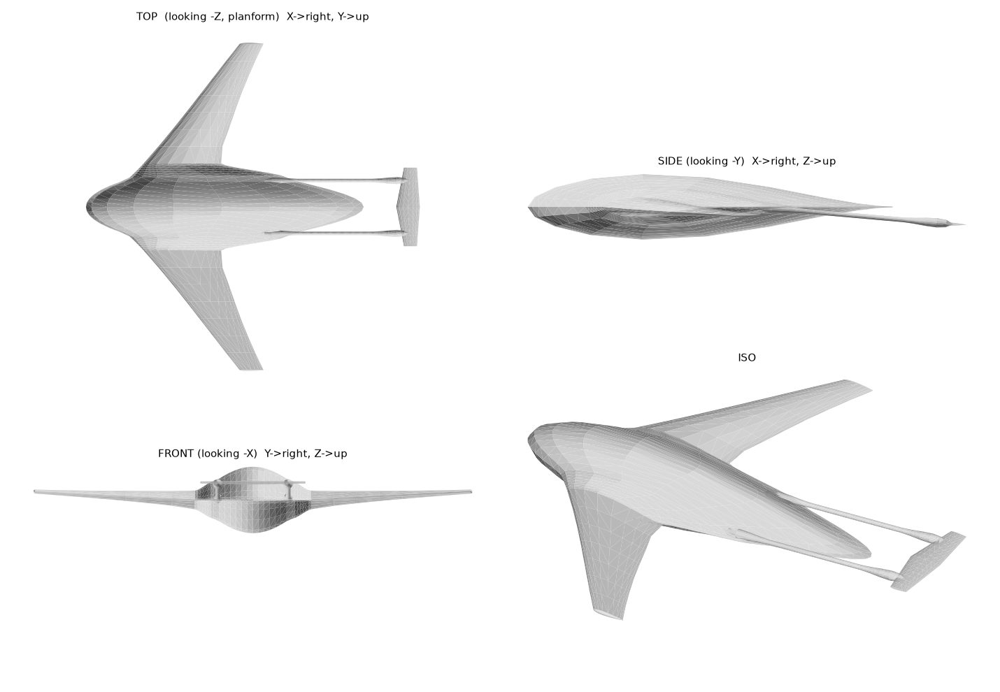 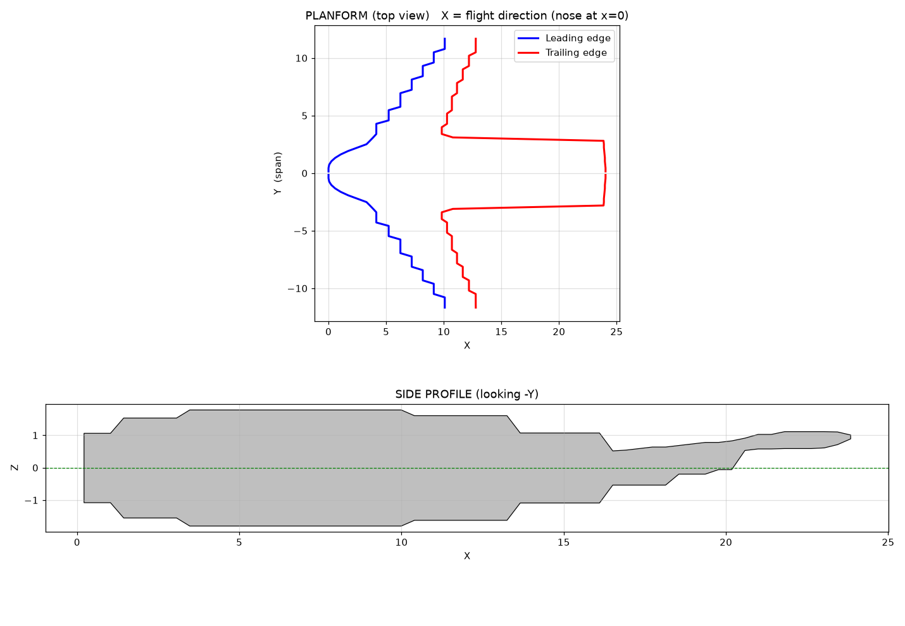 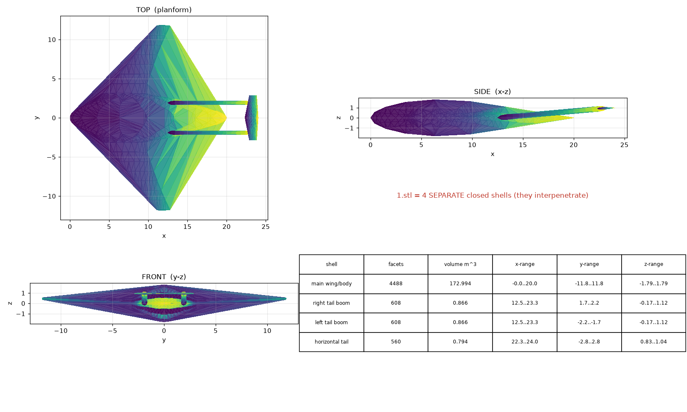

#### ① 怎么做出来的

- `geometry_views.png`：直接读取 `data/1.stl` 的三角形，正交投影渲染；
- `geometry_annotated.png`：把三角形投影到 (x,y) 平面取包络，
  积分得 $S$、$\mathrm{MAC}$、$x_{1/4}$，并在图上标出；
- `stl_components.png`：**连通分量分析**（并查集，按共享顶点合并），
  把 6264 个三角形分成 4 组并分别着色。

#### ② 图里看什么 / 为什么重要

`stl_components.png` 是**整个项目最关键的一张诊断图**：

| 壳体 | 面数 | 体积 m³ | 部位 |
| --- | ---: | ---: | --- |
| 1 | 4 488 | 172.99 | 机身 + 主机翼 |
| 2 | 608 | 0.87 | 右尾撑 |
| 3 | 608 | 0.87 | 左尾撑 |
| 4 | 560 | 0.79 | 平尾 |

四个壳体**互相穿插**（欧拉示性数 = 52，多连通）。
每条边恰好被 2 个三角形共用（**是流形的**），但整体**不是单一实体**。

> 🔴 **这就是为什么 Fluent 的所有布尔"挖洞"操作都失败**：
> OCC/Parasolid 无法对**自穿插的多壳体**做布尔运算。
> 解决方法是 `scripts/01_geometry/voxel_union.py` 的体素求并（射线奇偶计数）+ Marching Cubes。

#### ③ 反映的性能

- 三视图 → 确认**朝向**（X 飞行方向、Y 展向、Z 垂向）与真实尺寸；
- 标注图 → 确认 $S = 65.34$ m²、MAC = 4.20 m、AR = 8.56 —— **所有气动系数的基准**；
- 分解图 → 确认几何是否需要修复。

#### ④ 工程应用

- **参考量确认**：$S$ 与 MAC 取错会让所有 $C_L$/$C_D$ 系统性偏移（最常见的低级错误）；
- **几何前置检查**：任何 CFD 项目开工前必做（可省去数天的无效尝试）；
- **CAD 交付规范**：建议上游建模时输出**单一闭合实体**，避免此类问题。

---

## 4. 定量结论汇总

### 4.1 从图里读出的全部数字

| 类别 | 量 | 值 | 出处 |
| --- | --- | ---: | --- |
| **几何** | 翼展 b | 23.644 m | 三视图 |
| | 机长 | 24.037 m | 三视图 |
| | 参考面积 S | 65.338 m² | 标注图（平面形积分） |
| | MAC | 4.200 m | 标注图 |
| | AR | 8.556 | b²/S |
| | 后掠角（前缘） | 40.65° | 标注图 |
| **升力** | $C_{L,\alpha}$ | 4.490 /rad | 系数曲线（0–8° 拟合） |
| | $C_{L,\alpha}$ 理论 | 5.093 /rad | Prandtl 升力线 |
| | CFD/理论 | **0.882** | — |
| | $\alpha_{L=0}$ | −0.30° | 系数曲线 |
| | $C_L(12°)$ | 0.8836（仍线性）→ 未失速 | 系数曲线 |
| **阻力** | $C_{D,0}$（拟合） | 0.0699 | 极曲线 |
| | $k$（拟合） | 0.1660 | 极曲线 |
| | $k$ 理论（e = 0.8） | 0.0465 | $1/(\pi\mathrm{AR}e)$ |
| | Oswald e（反推） | **0.224** | $1/(\pi\mathrm{AR}k)$ |
| | 诱导阻力占比（8°） | 53% | $kC_L^2/C_D$ |
| **效率** | $(L/D)_{\max}$ | **4.93 @ 8°** | 系数曲线 |
| | 最佳 $C_L$ | 0.649（拟合 0.649） | $\sqrt{C_{D,0}/k}$ |
| **压力** | $C_p$ 上限（驻点） | +1.04（理论 +1） | 表面云图 |
| | $C_p$ 下限（12°） | −2.73 | 表面云图 |
| | 最大 V/V∞（12°） | 1.93 | $1-C_p$ |
| | $C_p^{*}$（临界） | −18.70 | Ma 0.187 → **全域亚声速** |
| **近壁** | y⁺ 中位数 | **940** | probe25 |
| | 第一层高度 | 12.2 mm | 反推 |
| | 边界层厚度（x=MAC） | 60 mm | 平板湍流 $0.37x\,\mathrm{Re}_x^{-1/5}$ |
| | 边界层厚度（x=24 m） | 243 mm | 同上 |
| **涡系** | 翼根环量 Γ₀（8°） | 68.5 m²/s | $4L/(\rho V\pi b)$ |
| | 涡核最大切向速度 | ≈ 14 m/s | Lamb–Oseen |
| | 涡对下沉速度 | 0.46 m/s | $\Gamma_0/(2\pi b)$ |
| | 理论下洗角（8°） | 1.38° | $C_L/(\pi\mathrm{AR})$ |
| **任务** | 配平速度（3500 kg） | 46.9 m/s = 169 km/h | $\sqrt{2mg/(\rho S C_L)}$ |
| | 需轴功率（3500 kg） | 408 kW | $mgV/(\eta L/D)$ |
| | 航程（4000→3400 kg） | 942 km | Breguet |
| | 航时 | 1.74 h | Breguet（螺旋桨） |

### 4.2 结果自洽性检查（四道关）

| 检查项 | 判据 | 结果 |
| --- | --- | --- |
| ① 驻点压力 | $C_{p,\max} \to +1$ | **+1.04** ✓ |
| ② 远场压力 | 域内平均 → p∞ = 54 019.9 Pa | **54 025 Pa** ✓（误差 0.01%） |
| ③ 侧向对称性 | $F_y \approx 0$ | **< 0.5% L** ✓ |
| ④ 升力线斜率 | CFD ≈ Prandtl 理论 | **0.882** ✓（12% 差，机身/平尾/粘性可解释） |

> 前三项说明**压力场与对称性求解正确**；
> 第四项说明**升力趋势可信**。
> 只有**阻力绝对值**因 y⁺ 过大而偏高 —— 见 §6。

---

## 5. 工程应用映射

| 后处理结果 | 直接支撑的工程决策 |
| --- | --- |
| **系数曲线** | 巡航速度/攻角选取、发动机功率选型、航程航时估算、飞控迎角限制、失速保护阈值 |
| **极曲线** | 最佳升阻比点（远航）与最大 $C_L^{3/2}/C_D$ 点（久航）分离、滑翔比、下降率 |
| **三维 C_p 云图** | 翼面/蒙皮**分布气动载荷** → 结构有限元输入；口盖与开口布置；防冰加热区 |
| **上下表面 C_p** | 翼型选型与修形、襟翼/副翼铰链力矩、压力中心移动、翼梁布置 |
| **对称面场** | 减阻修形、进气/排气布置、尾翼当地迎角（平尾效率）、环控泄流路径 |
| **对称面流线** | 分离起始站位 → 涡流发生器/前缘缝翼布置；空速管与迎角传感器选址 |
| **翼尖涡 3D** | 翼尖小翼收益量化、尾流间隔标准、编队飞行省油走廊、螺旋桨盘面干扰评估 |
| **尾涡横截面** | 尾流危害半径、网格自适应加密依据、翼尖装置效果（峰值涡量下降） |
| **水平面尾迹** | 尾翼抖振评估、后置螺旋桨叶片载荷脉动、编队/加油走廊 |
| **残差史** | 判定结果可否出具报告；诊断网格/松弛/边界问题 |
| **几何分解图** | CFD 开工前的几何前置检查（本项目靠它省下了数天） |

### 5.1 典型工作流：从 CFD 结果到结构设计

```
C_p 云图（本文 §3.3）
   │  p_local = p∞ + C_p·q∞
   ▼
翼面分布压强 [Pa]（本例 12° 时最恶劣：p ∈ [17.8 kPa, 70.5 kPa]）
   │  映射到结构网格
   ▼
ANSYS Mechanical APDL / Workbench 静力分析
   │
   ▼
翼梁/蒙皮应力、变形、屈曲校核  →  本工作区已有 ansys-mapdl-fea 技能可衔接
```

> 局部压强范围（12°，最恶劣工况）：
> $p_{\min} = 54019.9 + (-2.734)\times1325.0 = 17\,796$ Pa
> $p_{\max} = 54019.9 + (1.010)\times1325.0 = 70\,358$ Pa
> → 翼面最大净吸力 $p_{\min}-p_\infty = 17\,796-54\,020 = \mathbf{-36.2\ kPa}$（相对内腔常压），
> 即每平方米约 3.7 吨的向外吸力，这是蒙皮与翼肋设计的关键载荷。

### 5.2 典型工作流：从 CFD 结果到任务规划

```
系数曲线 → (L/D)max = 4.93 @ CL = 0.6487
   │
   ├─► 远航速度：V = √(2mg/(ρS·0.6487))   （Breguet R ∝ L/D）
   ├─► 久航速度：最大化 C_L^{3/2}/C_D       （Breguet E）
   └─► 需用功率：P = mgV/(η·L/D)           → 燃油流量 → 航时
```

---

## 6. 可信度与误差来源

### 6.1 误差清单

| 来源 | 影响量 | 方向 | 量级 |
| --- | --- | --- | --- |
| **无边界层棱柱**（y⁺ = 940，走壁面函数） | $C_D$ | **高估** | **2.5–3×** |
| 尾迹网格偏粗（远场 2.5 m） | 诱导阻力、涡衰减 | 高估阻力、涡过快衰减 | 显著 |
| 体素重建阶梯（0.06 m） | 表面摩擦与压差 | 略增阻力 | 小 |
| 稳态 RANS 处理 12° 分离 | $C_L$/$C_D$ @ 12° | 不确定 | 中等 |
| 连续性残差平台 O(1) | 力的小幅波动 | ±1% | 小 |
| $C_M$ 缺失 | 静稳定性 | — | 无法评估 |
